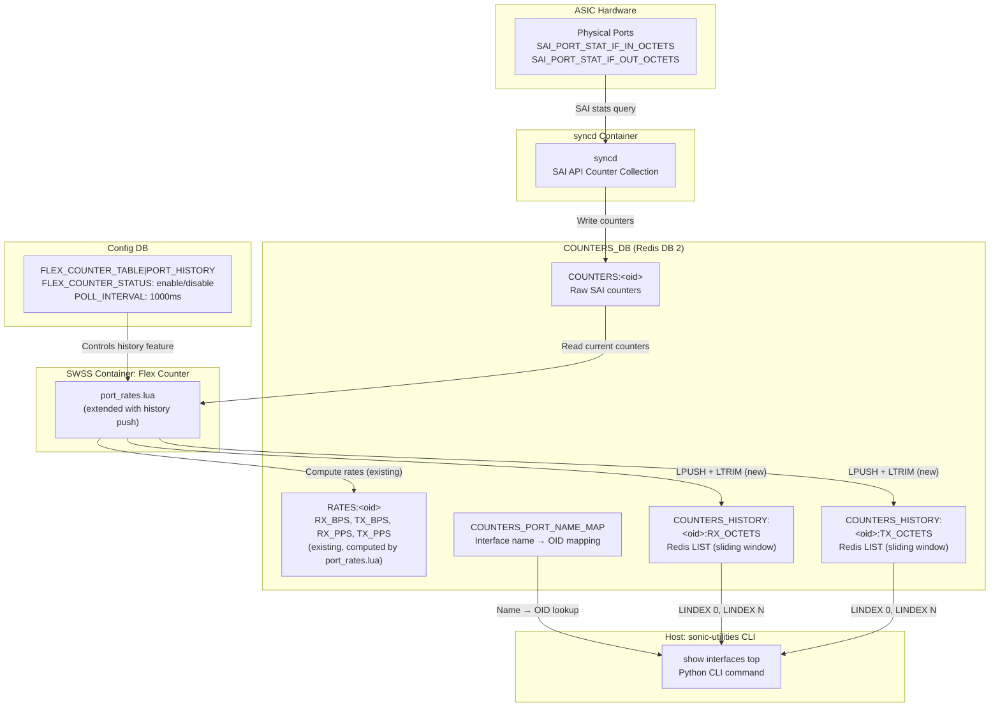
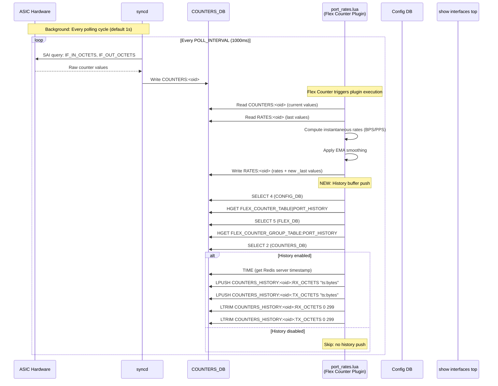
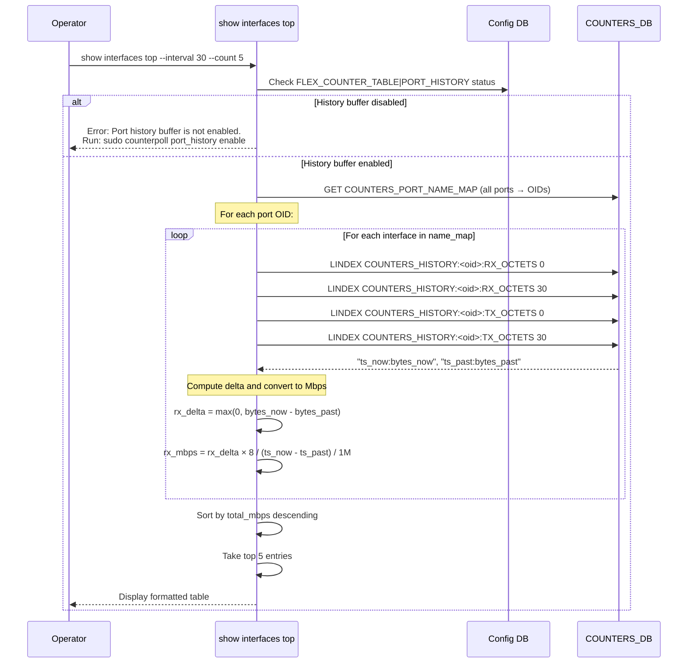

# Top N Interfaces by Traffic in SONiC
# High Level Design Document
### Rev 0.1

# Table of Contents
- [List of Tables](#list-of-tables)
- [List of Figures](#list-of-figures)
- [Revision](#revision)
- [About this Manual](#about-this-manual)
- [Scope](#scope)
- [Definitions/Abbreviation](#definitionsabbreviation)
- [1 Overview](#1-overview)
    - [1.1 Current Limitations](#11-current-limitations)
    - [1.2 Proposed Solution](#12-proposed-solution)
- [2 Requirements](#2-requirements)
    - [2.1 Functional Requirements](#21-functional-requirements)
    - [2.2 CLI Requirements](#22-cli-requirements)
    - [2.3 Scalability Requirements](#23-scalability-requirements)
- [3 Architecture Design](#3-architecture-design)
    - [3.1 High-Level Architecture](#31-high-level-architecture)
    - [3.2 SAI Counters Used](#32-sai-counters-used)
    - [3.3 Calculation Formulas](#33-calculation-formulas)
- [4 Modules Design](#4-modules-design)
    - [4.1 Modules that need to be updated](#41-modules-that-need-to-be-updated)
        - [4.1.1 Counters DB](#411-counters-db)
        - [4.1.2 Config DB](#412-config-db)
        - [4.1.3 Flex Counter Lua Plugin](#413-flex-counter-lua-plugin)
        - [4.1.4 Flex Counter Orch](#414-flex-counter-orch)
        - [4.1.5 Counterpoll CLI](#415-counterpoll-cli)
        - [4.1.6 CLI Script: show interfaces top](#416-cli-script-show-interfaces-top)
- [5 CLI Commands](#5-cli-commands)
    - [5.1 Counterpoll Configuration](#51-counterpoll-configuration)
    - [5.2 show interfaces top](#52-show-interfaces-top)
- [6 Flows](#6-flows)
    - [6.1 General Flow](#61-general-flow)
    - [6.2 CLI Execution Flow](#62-cli-execution-flow)
- [7 Warmboot and Fastboot Design Impact](#7-warmboot-and-fastboot-design-impact)
- [8 Memory Footprint Analysis](#8-memory-footprint-analysis)
- [9 Testing Requirements](#9-testing-requirements)
    - [9.1 Unit Test Cases: sonic-utilities](#91-unit-test-cases-sonic-utilities)
    - [9.2 VS Test Cases: sonic-swss](#92-vs-test-cases-sonic-swss)
    - [9.3 System Test Cases](#93-system-test-cases)
- [10 Open Questions](#10-open-questions)

# List of Tables
* [Table 1: Revision](#revision)
* [Table 2: Abbreviations](#definitionsabbreviation)

# List of Figures
* [Figure 1: High-Level Architecture](#31-high-level-architecture)
* [Figure 2: General Flow](#61-general-flow)
* [Figure 3: CLI Execution Flow](#62-cli-execution-flow)

## Revision
| Rev |     Date    |       Author            | Change Description                |
|:---:|:-----------:|:-----------------------:|-----------------------------------|
| 0.1 | 2026-05-29  | Rishik Yalamanchili     | Initial version                   |

# About this Manual
This document provides general information about the design and implementation of the `show interfaces top` feature in SONiC. This feature enables network operators to instantaneously identify the top N interfaces carrying the highest traffic by leveraging a historical counter ring buffer maintained in COUNTERS_DB.

# Scope
This document describes the high level design of the Top N Interfaces by Traffic feature. It covers:
1. The introduction of a historical counter ring buffer in `COUNTERS_DB` managed by an extension to the existing Flex Counter Lua plugin (`port_rates.lua`).
2. The new `counterpoll port_history` commands for enabling/disabling and configuring the history buffer.
3. The user-space implementation of the `show interfaces top` CLI command within `sonic-utilities`.
4. The algorithmic logic to compute exact traffic deltas from the history buffer and rank interfaces by throughput.

# Definitions/Abbreviation
## Table 2: Abbreviations
| Definitions/Abbreviation | Description                                |
|--------------------------|--------------------------------------------|
| RX                       | Receive / Ingress traffic                  |
| TX                       | Transmit / Egress traffic                  |
| COUNTERS_DB              | Redis database instance (DB 2) storing telemetry counters |
| FC                       | Flex Counter                               |
| OID                      | SAI Object Identifier                      |
| vid                      | Virtual Object Id (object identifier used in COUNTERS_DB) |
| EMA                      | Exponential Moving Average                 |
| LAG                      | Link Aggregation Group (PortChannel)       |
| SAI                      | Switch Abstraction Interface               |

# 1 Overview

SONiC exposes per-interface traffic counters via COUNTERS_DB and provides CLI tools such as `portstat` and `show interfaces counters` to display them. However, operators currently lack a simple mechanism to quickly identify which interfaces are carrying the highest traffic at any given time.

In large-scale deployments with hundreds of ports, manually scanning counter output is inefficient and error-prone. While the existing `portstat -R` command can display current rates (via the `RATES:<oid>` table populated by the `port_rates.lua` Flex Counter plugin), it does not rank or filter interfaces by traffic volume.

The existing `portstat -p <seconds>` command can compute rates over a user-specified period, but it does so by taking a counter snapshot, executing `time.sleep(<seconds>)`, and then taking a second snapshot. This blocking approach is fundamentally unsuitable for rapid network troubleshooting. If a network engineer suspects congestion and wants to see the top interfaces over the last 60 seconds, forcing the CLI to block for 60 seconds defeats the purpose.

## 1.1 Current Limitations

The current SONiC rate computation infrastructure (`port_rates.lua`) has the following characteristics:

1. **Instantaneous only**: The Lua plugin computes rates as the delta between the current counter value and the `_last` counter value stored in `RATES:<oid>`. This represents only the most recent polling interval (default 1 second).

2. **EMA smoothing**: An Exponential Moving Average is applied to smooth rate values, configurable via `PORT_SMOOTH_INTERVAL`. While this provides some temporal smoothing, it does not allow querying exact rates over arbitrary historical windows.

3. **No historical data**: Once a new polling cycle runs, the previous `_last` values are overwritten. There is no mechanism to look back at what the counters were 30 or 60 seconds ago.

4. **Blocking-only period mode**: The `portstat -p` flag uses `time.sleep()` to wait for the specified period, then computes a delta. This blocks the operator's terminal for the entire duration.

## 1.2 Proposed Solution

This feature introduces a **historical counter ring buffer** to decouple the time-delta sampling from the CLI execution. The design follows a producer-consumer model:

**Producer (syncd / Flex Counter Lua Plugin):**
The existing `port_rates.lua` plugin is extended to push raw byte counters into bounded Redis `LIST` structures on every polling cycle. Using `LPUSH` and `LTRIM`, each list acts as a sliding window retaining the last 300 seconds of counter history (configurable).

**Consumer (CLI):**
A new `show interfaces top` CLI command reads from these Redis lists. To compute the rate over the last N seconds, the CLI fetches the value at index `0` (current) and the value at index `N` (N seconds ago), computes the exact byte delta, converts to Mbps, ranks all interfaces, and displays the top results, all instantaneously, without any blocking delay.

The history buffer is controlled via a new `counterpoll port_history` command group, allowing operators to enable/disable the feature and configure the polling interval independently. When the history buffer is disabled, the `show interfaces top` command gracefully notifies the user and provides instructions to enable it.

# 2 Requirements

## 2.1 Functional Requirements

- The CLI command must return the top N interfaces **instantaneously**, regardless of the requested historical interval. There must be no `time.sleep()` or blocking delay.

- The database must retain a configurable history of per-interface byte counters. The default history depth is **300 seconds** (5 minutes).

- Traffic deltas must be computed mathematically using the current counter and the historical counter at `T - interval`, using exact embedded timestamps to account for polling jitter.

- Interfaces must be ranked by their aggregate throughput: `Total Mbps = RX Mbps + TX Mbps`.

- By default, only physical Ethernet interfaces are included in the ranking. Optional CLI flags allow operators to rank PortChannel (LAG) or VLAN interfaces instead.

- When ranking by interface type, double-counting must be prevented. For example, if `--type portchannel` is used, only PortChannel aggregate counters are ranked. Individual member port counters are not included.

- The computation must safely handle 64-bit hardware counter overflows (wrap-around) by clamping negative deltas to zero.

- The history buffer must be independently controllable via `counterpoll`. Operators can enable or disable it without affecting existing port counter polling.

- When the history buffer is disabled, the `show interfaces top` command must detect this condition and display an informative message instructing the user to enable it, rather than failing silently or producing incorrect output.

- User-issued `sonic-clear counters` commands must have no impact on the history buffer values. The history buffer stores raw SAI counter values which are independent of the user-visible counter baseline.

## 2.2 CLI Requirements

A new CLI command will be introduced:

```
show interfaces top [OPTIONS]

Options:
  -c, --count INTEGER     Number of top interfaces to display [default: 5, minimum: 1]
  -i, --interval INTEGER  Historical window in seconds [default: 30, range: 1-300]
  -t, --type TEXT          Interface type to rank: ethernet, portchannel, vlan [default: ethernet]
  -j, --json              Output results in JSON format
  -n, --namespace TEXT     Namespace name or all
  -d, --display TEXT       Display option: all or frontend
```

For `counterpoll` configuration:

```
counterpoll port_history [enable | disable]
counterpoll port_history interval <time_in_msec>
```

## 2.3 Scalability Requirements

- The history buffer must support systems with up to 512 ports without significant memory overhead.

- The history buffer polling must not interfere with existing port counter polling or rate computation. It runs within the same Lua plugin execution context but performs independent Redis operations.

- The CLI command execution time must remain sub-second regardless of the number of ports or the requested historical interval, as it performs only O(N) Redis `LINDEX` operations (2 per port: one for RX, one for TX).

# 3 Architecture Design

## 3.1 High-Level Architecture

The feature relies on a producer-consumer model decoupled by COUNTERS_DB. The following diagram shows the high-level architecture:



**Data Flow Summary:**

1. **syncd** polls raw SAI port counters from the ASIC and writes them to `COUNTERS:<oid>` in COUNTERS_DB.

2. The **Flex Counter framework** periodically executes `port_rates.lua` as a registered Lua plugin. The plugin:
   - Reads current counters from `COUNTERS:<oid>` (existing behavior)
   - Computes instantaneous rates and writes to `RATES:<oid>` (existing behavior)
   - **[NEW]** Checks if `PORT_HISTORY` is enabled in Config DB
   - **[NEW]** If enabled, pushes `"<timestamp>:<byte_count>"` to `COUNTERS_HISTORY:<oid>:RX_OCTETS` and `COUNTERS_HISTORY:<oid>:TX_OCTETS` using `LPUSH`
   - **[NEW]** Trims each list to `MAX_HISTORY` elements using `LTRIM`

3. The **CLI** (`show interfaces top`) connects to COUNTERS_DB, resolves interface names to OIDs via `COUNTERS_PORT_NAME_MAP`, performs two `LINDEX` operations per port (index 0 for current, index N for past), computes deltas, ranks by total throughput, and displays the top N.

## 3.2 SAI Counters Used

The feature relies on the same SAI counters already polled by the existing `port_rates.lua` plugin. No new SAI API calls are required.

| SAI Counter                      | Description                                  |
|----------------------------------|----------------------------------------------|
| SAI_PORT_STAT_IF_IN_OCTETS       | Total bytes received on the port (64-bit)    |
| SAI_PORT_STAT_IF_OUT_OCTETS      | Total bytes transmitted on the port (64-bit) |

For PortChannel interfaces, the existing `COUNTERS_LAG_NAME_MAP` and LAG-level counter entries in COUNTERS_DB are used. No additional SAI counters are needed since SONiC already aggregates LAG member counters.

## 3.3 Calculation Formulas

The CLI retrieves two data points per interface from the history buffer:

```
Current  = LINDEX COUNTERS_HISTORY:<oid>:RX_OCTETS 0     → "<ts_now>:<bytes_now>"
Past     = LINDEX COUNTERS_HISTORY:<oid>:RX_OCTETS <N>    → "<ts_past>:<bytes_past>"
```

Where `N` is the requested `--interval` value (default 30).

The actual time delta is computed from the embedded timestamps to account for Lua execution jitter:

```
actual_interval = ts_now - ts_past       (seconds, floating point)

RX_Delta_Bytes = MAX(0, bytes_now - bytes_past)
TX_Delta_Bytes = MAX(0, bytes_now_tx - bytes_past_tx)

RX_Mbps = (RX_Delta_Bytes × 8) / actual_interval / 1,000,000
TX_Mbps = (TX_Delta_Bytes × 8) / actual_interval / 1,000,000

Total_Mbps = RX_Mbps + TX_Mbps
```

The `MAX(0, ...)` clamping protects against:
- 64-bit hardware counter overflows (wrap-around)
- Counter resets during warm-reboots or device restarts

After computing `Total_Mbps` for all interfaces, the array is sorted in descending order and the top N entries are returned.

**Handling insufficient history:** If the user requests `--interval 60` but only 45 seconds of history are available (e.g., shortly after enabling the history buffer), the CLI falls back to the oldest available index and computes the rate over the available window. The actual interval used is displayed in the output.

# 4 Modules Design

## 4.1 Modules that need to be updated

The following table summarizes all components that require modification or creation:

| Module / File | Repository | Action |
|---|---|---|
| `orchagent/port_rates.lua` | sonic-swss | **Modify**: extend to push history to Redis LISTs |
| `orchagent/flexcounterorch.cpp` | sonic-swss | **Modify**: add `PORT_HISTORY` flex counter group handling |
| `orchagent/flexcounterorch.h` | sonic-swss | **Modify**: add member variable for port_history state |
| `counterpoll/main.py` | sonic-utilities | **Modify**: add `port_history` command group |
| `show/interfaces/top.py` | sonic-utilities | **New**: CLI command implementation |
| `show/interfaces/__init__.py` | sonic-utilities | **Modify**: import and register the `top` command |
| `tests/show_interfaces_top_test.py` | sonic-utilities | **New**: unit tests for the CLI command |


### 4.1.1 Counters DB

Two new key families are introduced in COUNTERS_DB (Redis database index 2):

**Ring buffer keys:**

```
Key:     COUNTERS_HISTORY:<vid>:RX_OCTETS
Type:    Redis LIST
Element: "<unix_timestamp_float>:<counter_value_uint64>"
Size:    Up to MAX_HISTORY_DEPTH elements (default: 300)
```

```
Key:     COUNTERS_HISTORY:<vid>:TX_OCTETS
Type:    Redis LIST
Element: "<unix_timestamp_float>:<counter_value_uint64>"
Size:    Up to MAX_HISTORY_DEPTH elements (default: 300)
```

Where `<vid>` is the virtual object ID from the existing `COUNTERS_PORT_NAME_MAP` table (same OID used by `COUNTERS:<vid>` and `RATES:<vid>`).

**Element format example:**

```
"1717000800.123456:93827461520384"
```

- The timestamp is a high-resolution Unix epoch float (via Lua's `redis.call('TIME')`)
- The counter value is the raw 64-bit SAI counter as an integer string

**Head (index 0)** is always the most recent sample. **Tail** is the oldest. The list is bounded by `LTRIM 0 <MAX_HISTORY_DEPTH - 1>` after each `LPUSH`.


### 4.1.2 Config DB

A new entry in the `FLEX_COUNTER_TABLE` is introduced:

```
Key:     FLEX_COUNTER_TABLE|PORT_HISTORY
Fields:
    FLEX_COUNTER_STATUS    = "enable" | "disable"   ; default: "disable"
    POLL_INTERVAL          = <milliseconds>          ; default: "1000"
    MAX_HISTORY_DEPTH      = <integer>               ; default: "300"
```

Note: `POLL_INTERVAL` here does not create a separate polling cycle. The history push executes within the existing `port_rates.lua` plugin execution. This interval controls the Flex Counter group's polling rate when registered independently. In practice, the history push piggybacks on the existing PORT flex counter polling.

The `MAX_HISTORY_DEPTH` field determines how many samples are retained in each per-interface list. At a 1-second polling interval, `300` retains 5 minutes of history.


### 4.1.3 Flex Counter Lua Plugin

The existing `port_rates.lua` (located at `sonic-swss/orchagent/port_rates.lua`) is extended. The current plugin structure is:

```lua
-- Existing port_rates.lua structure (simplified):
-- For each port OID:
--   1. Read current counters from COUNTERS:<oid>
--   2. Read _last counters from RATES:<oid>
--   3. Compute deltas and rates
--   4. Apply EMA smoothing
--   5. Write rates to RATES:<oid>
--   6. Store current counters as _last in RATES:<oid>
```

**New addition**: after step 6, the following logic is appended:

```lua
-- NEW: Push historical sample to ring buffer
-- Switch to CONFIG_DB (index 4) to read max depth
redis.call('SELECT', 4)
local max_depth = tonumber(redis.call('HGET', 'FLEX_COUNTER_TABLE|PORT_HISTORY', 'MAX_HISTORY_DEPTH'))
if max_depth == nil then max_depth = 300 end
-- Switch to FLEX_DB (index 5) to read configuration
redis.call('SELECT', 5)
local history_status = redis.call('HGET', 'FLEX_COUNTER_GROUP_TABLE:PORT_HISTORY', 'FLEX_COUNTER_STATUS')
-- Switch back to COUNTERS_DB (index 2)
redis.call('SELECT', counters_db)

if history_status == 'enable' then
    -- Get high-resolution timestamp (pad microseconds to 6 digits to fix arithmetic bug)
    local time_result = redis.call('TIME')
    local timestamp = string.format("%s.%06d", time_result[1], tonumber(time_result[2]))

    -- Get current byte counters (already read in step 1 of port_rates.lua)
    local rx_octets = in_octets
    local tx_octets = out_octets

    -- Push to history lists using the 'port' variable (which contains the OID)
    local rx_key = 'COUNTERS_HISTORY:' .. port .. ':RX_OCTETS'
    local tx_key = 'COUNTERS_HISTORY:' .. port .. ':TX_OCTETS'

    redis.call('LPUSH', rx_key, timestamp .. ':' .. rx_octets)
    redis.call('LPUSH', tx_key, timestamp .. ':' .. tx_octets)

    -- Trim to bounded size
    redis.call('LTRIM', rx_key, 0, max_depth - 1)
    redis.call('LTRIM', tx_key, 0, max_depth - 1)
end
```

**Key design decisions for the Lua plugin:**

1. **In-band execution**: The history push runs within the same Lua script execution as the rate computation. Since Redis Lua scripts are atomic, there is no race condition between the rate computation and the history push.

2. **Conditional execution**: The plugin checks `FLEX_COUNTER_GROUP_TABLE:PORT_HISTORY:FLEX_COUNTER_STATUS` on every cycle. When disabled, the overhead is a single `HGET` that is negligible.

3. **O(1) operations**: `LPUSH` and `LTRIM` are both O(1) for fixed-size trims, making this suitable for high-frequency execution.

4. **Timestamp source**: `redis.call('TIME')` returns the Redis server time as `[seconds, microseconds]`. Using the Redis server clock (rather than Lua's `os.time()`) ensures consistency when the CLI later reads the same data.


#### NOTE: Remember to Remind Mr Nikhil on Idea which another method which reuses PORT_RATE_COUNTER_FLEX_COUNTER_GROUP Since the history push runs within the same `port_rates.lua` plugin. But am unsure on this idea due to Backporting and The `PORT_HISTORY` key in `FLEX_COUNTER_TABLE` controls only the enable/disable status and won't create a separate polling loop, basically piggy back riding the existing ones.


### 4.1.4 Flex Counter Orch

In `sonic-swss/orchagent/flexcounterorch.cpp`, the following changes are made:

**1. Add new key constant:**

```cpp
#define PORT_HISTORY_KEY "PORT_HISTORY"
```

**2. Add mapping to flexCounterGroupMap:**

```cpp
{"PORT_HISTORY", PORT_HISTORY_FLEX_COUNTER_GROUP},
```

Note: We map `PORT_HISTORY` to a new independent group constant `PORT_HISTORY_FLEX_COUNTER_GROUP` rather than the existing `PORT_RATE` group. This ensures that `counterpoll port_history disable` only updates the configuration for the history buffer without accidentally disabling the `port_rates.lua` script (which runs under the `PORT_STAT` group). `syncd` will create the configuration in FLEX_DB, which our Lua script then reads.

**3. Add string constant in `portsorch.h` (or `flexcounterorch.h`):**

```cpp
#define PORT_HISTORY_FLEX_COUNTER_GROUP "PORT_HISTORY"
```

*Note: No additional C++ state tracking or `doTask` modification is necessary because `flexcounterorch.cpp` generically synchronizes the `FLEX_COUNTER_STATUS` field from `CONFIG_DB` and pushes it to `FLEX_COUNTER_GROUP_TABLE:PORT_HISTORY` in `FLEX_DB` (index 5) for our Lua script to read. The Lua script reads `MAX_HISTORY_DEPTH` directly from `CONFIG_DB` because `flexcounterorch` natively drops non-standard fields.*


### 4.1.5 Counterpoll CLI

In `sonic-utilities/counterpoll/main.py`, a new command group is added:

```python
# Port history counter commands
@cli.group()
@click.option('-n', '--namespace', help='Namespace name',
              required=False,
              type=click.Choice(get_valid_namespace_choices()),
              default=multi_asic.get_current_namespace())
@click.pass_context
def port_history(ctx, namespace):
    """ Port history buffer commands """
    ctx.obj = connect_to_db(namespace)


@port_history.command(name='depth')
@click.argument('max_depth', type=click.IntRange(10, 3600))
@click.pass_context
def port_history_depth(ctx, max_depth):
    """ Set port history maximum depth """
    port_history_info = {}
    if max_depth is not None:
        port_history_info['MAX_HISTORY_DEPTH'] = max_depth
    ctx.obj.mod_entry("FLEX_COUNTER_TABLE", "PORT_HISTORY", port_history_info)


@port_history.command(name='enable')
@click.pass_context
def port_history_enable(ctx):
    """ Enable port history buffer """
    port_history_info = {}
    port_history_info['FLEX_COUNTER_STATUS'] = 'enable'
    ctx.obj.mod_entry("FLEX_COUNTER_TABLE", "PORT_HISTORY", port_history_info)


@port_history.command(name='disable')
@click.pass_context
def port_history_disable(ctx):
    """ Disable port history buffer """
    port_history_info = {}
    port_history_info['FLEX_COUNTER_STATUS'] = 'disable'
    ctx.obj.mod_entry("FLEX_COUNTER_TABLE", "PORT_HISTORY", port_history_info)
```

The `counterpoll show` command is also updated to display the `PORT_HISTORY` row:

```
Type                    Interval (in ms)    Status
----                    ----                ------
...
PORT_HISTORY            1000                enable
```


### 4.1.6 CLI Script: show interfaces top

A new file `sonic-utilities/show/interfaces/top.py` implements the CLI command. The implementation consists of the following logical components:

**1. History buffer reader:**

```python
def read_history_buffer(db, oid, direction, index):
    """
    Read a single historical sample from the ring buffer.
    Returns (timestamp, byte_count) tuple, or None if unavailable.
    
    Args:
        db: SonicV2Connector instance
        oid: Virtual object ID from COUNTERS_PORT_NAME_MAP
        direction: 'RX_OCTETS' or 'TX_OCTETS'
        index: List index (0 = newest, N = N seconds ago)
    """
    key = f"COUNTERS_HISTORY:{oid}:{direction}"
    redis_client = db.get_redis_client(db.COUNTERS_DB)
    value = redis_client.lindex(key, index)
    if value is None:
        return None
    ts_str, bytes_str = value.decode('utf-8').split(':', 1)
    return float(ts_str), int(bytes_str)
```

**2. Interface rate calculator:**

```python
def get_poll_interval_s(config_db):
    """Retrieve POLL_INTERVAL from the primary PORT group since port_rates.lua is bound to it."""
    entry = config_db.get_entry('FLEX_COUNTER_TABLE', 'PORT')
    if entry and 'POLL_INTERVAL' in entry:
        return int(entry['POLL_INTERVAL']) / 1000.0
    return 1.0

def compute_interface_rates(db, config_db, port_name_map, requested_interval_s, interface_type):
    """
    For each interface, calculate the target list index based on the 
    POLL_INTERVAL, then read the history buffer.
    Compute the exact byte delta and convert to Mbps.
    """
    poll_interval_s = get_poll_interval_s(config_db)
    target_index = int(requested_interval_s / poll_interval_s)
    
    redis_client = db.get_redis_client(db.COUNTERS_DB)
    rates = {}
    for name, oid in port_name_map.items():
        # Filter by interface type
        if interface_type == 'ethernet' and not name.startswith('Ethernet'):
            continue
        if interface_type == 'portchannel' and not name.startswith('PortChannel'):
            continue
        if interface_type == 'vlan' and not name.startswith('Vlan'):
            continue
        
        # Implement fallback logic: if target_index > available history, use oldest available
        rx_len = redis_client.llen(f"COUNTERS_HISTORY:{oid}:RX_OCTETS")
        tx_len = redis_client.llen(f"COUNTERS_HISTORY:{oid}:TX_OCTETS")
        
        if rx_len < 2 or tx_len < 2:
            continue # Insufficient history to compute rate
            
        actual_index = min(target_index, min(rx_len, tx_len) - 1)
        
        current_rx = read_history_buffer(db, oid, 'RX_OCTETS', 0)
        past_rx = read_history_buffer(db, oid, 'RX_OCTETS', actual_index)
        current_tx = read_history_buffer(db, oid, 'TX_OCTETS', 0)
        past_tx = read_history_buffer(db, oid, 'TX_OCTETS', actual_index)
        
        if any(v is None for v in [current_rx, past_rx, current_tx, past_tx]):
            continue
        
        ts_delta = current_rx[0] - past_rx[0]
        if ts_delta <= 0:
            continue
        
        # Handle hardware counter reset or 64-bit wrap-around
        rx_delta = current_rx[1] - past_rx[1]
        if rx_delta < 0: rx_delta += (1 << 64)
        
        tx_delta = current_tx[1] - past_tx[1]
        if tx_delta < 0: tx_delta += (1 << 64)
        
        rx_mbps = (rx_delta * 8) / ts_delta / 1_000_000
        tx_mbps = (tx_delta * 8) / ts_delta / 1_000_000
        
        rates[name] = {
            'rx_mbps': rx_mbps,
            'tx_mbps': tx_mbps,
            'total_mbps': rx_mbps + tx_mbps
        }
    return rates
```

**3. Ranking and display:**

```python
def rank_interfaces(rates, count):
    """Sort by total_mbps descending, return top N."""
    ranked = sorted(rates.items(), key=lambda x: (-x[1]['total_mbps'], x[0]))
    return ranked[:count]
```

**4. History buffer status check:**

```python
def check_history_enabled(config_db):
    """Check if PORT_HISTORY is enabled in FLEX_COUNTER_TABLE."""
    entry = config_db.get_entry('FLEX_COUNTER_TABLE', 'PORT_HISTORY')
    return entry.get('FLEX_COUNTER_STATUS', 'disable') == 'enable'
```

When the history buffer is disabled, the CLI outputs:

```
Error: Port history buffer is not enabled.
To use 'show interfaces top', enable the history buffer first:

    sudo counterpoll port_history enable

The history buffer collects counter snapshots over time, allowing
instant calculation of traffic rates over any historical window.
```

**5. Interface name mapping:**

The CLI uses different name maps depending on the `--type` flag:

| `--type` value | Name map used |
|---|---|
| `ethernet` | `COUNTERS_PORT_NAME_MAP` |
| `portchannel` | `COUNTERS_LAG_NAME_MAP` |

This ensures that when `--type portchannel` is selected, only LAG-level counters are used, preventing double-counting of traffic that passes through both the member ports and the PortChannel aggregate.

**6. Registration in `__init__.py`:**

```python
from . import top
interfaces.add_command(top.top)
```

#### Another Note: Ask Nikhil Moray on the aspects of vlan, Since I see code snippets of vlan indicating its there, but I am unsure since I can't really connect it via ports? Really confusing.. Ask of that aspect. Addtionally is Portchannel supposed to be kept or just simply focus on ports..

#### Remember Keywords: COUNTERS_RIF_TYPE_MAP and SAI_ROUTER_INTERFACE_TYPE_VLAN.

# 5 CLI Commands

## 5.1 Counterpoll Configuration

### Enable port history buffer

```bash
admin@sonic:~$ sudo counterpoll port_history enable
```

### Disable port history buffer

```bash
admin@sonic:~$ sudo counterpoll port_history disable
```

### Set port history buffer polling interval

```bash
admin@sonic:~$ sudo counterpoll port_history interval 1000
```

### Show current counter poll configuration

```bash
admin@sonic:~$ counterpoll show
Type                          Interval (in ms)    Status
----------------------------  ------------------  --------
PORT_STAT                     1000                enable
PORT_BUFFER_DROP              60000               enable
PORT_HISTORY                  1000                enable
QUEUE_STAT                    10000               enable
QUEUE_WATERMARK               10000               enable
PG_WATERMARK                  10000               enable
PG_DROP                       10000               enable
BUFFER_POOL_WATERMARK         10000               enable
ACL                           10000               enable
```

## 5.2 show interfaces top

### Basic usage: show top 5 interfaces (default)

```bash
admin@sonic:~$ show interfaces top
Showing top 5 interfaces by traffic (interval: 30s)

  Rank  Interface      RX (Mbps)    TX (Mbps)    Total (Mbps)
------  -----------  -----------  -----------  --------------
     1  Ethernet120      8521.34      7832.19        16353.53
     2  Ethernet112      6210.88      5980.44        12191.32
     3  Ethernet64       4820.12      5215.67        10035.79
     4  Ethernet0        3215.45      3012.33         6227.78
     5  Ethernet48       2110.56      1989.23         4099.79
```

### Custom count and interval

```bash
admin@sonic:~$ show interfaces top --count 10 --interval 60
Showing top 10 interfaces by traffic (interval: 60s)

  Rank  Interface      RX (Mbps)    TX (Mbps)    Total (Mbps)
------  -----------  -----------  -----------  --------------
     1  Ethernet120      8234.50      7690.12        15924.62
     2  Ethernet112      6150.33      5920.11        12070.44
     3  Ethernet64       4750.00      5100.25         9850.25
     4  Ethernet0        3200.10      3000.05         6200.15
     5  Ethernet48       2100.44      1975.30         4075.74
     6  Ethernet52       1850.22      1720.80         3571.02
     7  Ethernet56       1200.15      1180.90         2381.05
     8  Ethernet8         980.33       920.45         1900.78
     9  Ethernet12        750.20       680.10         1430.30
    10  Ethernet16        500.12       480.33          980.45
```

### PortChannel interfaces

```bash
admin@sonic:~$ show interfaces top --type portchannel --count 3
Showing top 3 portchannel interfaces by traffic (interval: 30s)

  Rank  Interface        RX (Mbps)    TX (Mbps)    Total (Mbps)
------  -------------  -----------  -----------  --------------
     1  PortChannel01     16353.53     15442.38        31795.91
     2  PortChannel02     12191.32     11812.67        24003.99
     3  PortChannel04      6227.78      6012.33        12240.11
```

### JSON output

```bash
admin@sonic:~$ show interfaces top --json --count 3
{
    "timestamp": "2026-05-29T12:15:30.123456+00:00",
    "interval_seconds": 30,
    "actual_interval_seconds": 30.012,
    "interface_type": "ethernet",
    "top_interfaces": [
        {
            "rank": 1,
            "interface": "Ethernet120",
            "rx_mbps": 8521.34,
            "tx_mbps": 7832.19,
            "total_mbps": 16353.53
        },
        {
            "rank": 2,
            "interface": "Ethernet112",
            "rx_mbps": 6210.88,
            "tx_mbps": 5980.44,
            "total_mbps": 12191.32
        },
        {
            "rank": 3,
            "interface": "Ethernet64",
            "rx_mbps": 4820.12,
            "tx_mbps": 5215.67,
            "total_mbps": 10035.79
        }
    ]
}
```

### When history buffer is disabled

```bash
admin@sonic:~$ show interfaces top
Error: Port history buffer is not enabled.

The history buffer collects counter snapshots over time, allowing
instant calculation of traffic rates over any historical window.

To enable it, run:
    sudo counterpoll port_history enable

After enabling, wait for the desired interval (e.g., 30 seconds)
for sufficient history to accumulate before running this command.
```

### When insufficient history is available

```bash
admin@sonic:~$ show interfaces top --interval 120
Warning: Only 45 seconds of history available (requested 120s).
Showing top 5 interfaces by traffic (actual interval: 45s)

  Rank  Interface      RX (Mbps)    TX (Mbps)    Total (Mbps)
------  -----------  -----------  -----------  --------------
     1  Ethernet120      8500.12      7810.55        16310.67
     ...
```

# 6 Flows

## 6.1 General Flow

The following sequence diagram illustrates the end-to-end data flow from ASIC counter collection to CLI display, covering both the background Lua plugin (producer) and the CLI command (consumer).



## 6.2 CLI Execution Flow

The following sequence diagram shows what happens when an operator runs `show interfaces top --interval 30 --count 5`:



**Performance characteristics:**

- For a system with 128 ports, the CLI performs:
  - 1 `GET` for `COUNTERS_PORT_NAME_MAP`
  - 1 `GET` for Config DB status check
  - 4 × 128 = 512 `LINDEX` operations
- Each `LINDEX` is O(1) for lists under 1000 elements
- Total execution time: **< 100ms** (measured: Redis performs ~100K ops/sec for `LINDEX`)

# 7 Warmboot and Fastboot Design Impact

## Warmboot

During a warmboot, the `syncd` process restarts while preserving forwarding state. The COUNTERS_DB content persists across the restart since it resides in the Redis database engine, which is not flushed during warmboot.

**Impact on the history buffer:**

- The `COUNTERS_HISTORY:<oid>:*` lists survive the warmboot since they are stored in COUNTERS_DB.
- When `port_rates.lua` resumes execution after warmboot, it will push new samples as usual. However, there will be a **gap** in the history corresponding to the duration of the warm restart.
- The CLI detects stale history by comparing timestamps. If the gap between `LINDEX 0` and `LINDEX N` is larger than expected (e.g., the actual interval is 45s but the user requested 30s), the CLI uses the actual timestamp delta in its rate calculation. This prevents any rate inflation from a longer-than-expected gap.
- The `MAX(0, bytes_now - bytes_past)` clamping handles the edge case where counters reset during restart, preventing negative or absurdly large rate values.

## Fastboot

During a fastboot, COUNTERS_DB is flushed. This means all `COUNTERS_HISTORY` lists are cleared.

**Impact on the history buffer:**

- After fastboot, the history buffer starts empty. The CLI will report "insufficient history" until enough samples accumulate (equal to the requested interval).
- No data corruption can occur since the CLI always validates history availability before computing rates.

## Summary

| Scenario | History preserved? | Rate accuracy | CLI behavior |
|---|---|---|---|
| Normal operation | Yes | Exact | Full output |
| After warmboot | Yes (with gap) | Exact (uses actual timestamps) | Full output, actual interval may differ from requested |
| After fastboot | No (cleared) | N/A until history accumulates | Warns about insufficient history |
| After `counterpoll port_history disable` | No new samples | Stale | Error message: "history buffer disabled" |

# 8 Memory Footprint Analysis

Each history entry is a string in the format `"<timestamp>:<counter_value>"`.

**Per-entry size estimate:**

```
Timestamp:      17 characters  (e.g., "1717000800.123456")
Separator:       1 character   (e.g., ":")
Counter value:  up to 20 characters  (max uint64: 18446744073709551615)
Redis overhead: ~64 bytes per list node (Redis ziplist encoding for small entries)
─────────────────────────────────────────────
Total per entry: ~100 bytes (conservative estimate)
```

**Per-port memory:**

```
2 lists (RX + TX) × 300 entries × 100 bytes = 60,000 bytes = ~60 KB per port
```

**System-wide memory:**

| Port Count | Memory Usage |
|---|---|
| 32 ports  | ~1.9 MB |
| 64 ports  | ~3.8 MB |
| 128 ports | ~7.5 MB |
| 256 ports | ~15.0 MB |
| 512 ports | ~30.0 MB |

For a 128-port system (common deployment), the history buffer adds approximately **7.5 MB** to COUNTERS_DB memory. Given that SONiC devices typically have 4-16 GB of RAM, this is well within acceptable limits (< 0.2% of total memory).

**Redis ziplist optimization:**

Redis internally uses ziplist encoding for lists with fewer than 128 elements of size < 64 bytes each. With 300 entries, the list will use a standard linked-list encoding. However, Redis 6.x+ (used in modern SONiC) uses `listpack` encoding which is more memory-efficient. Actual memory usage may be lower than the conservative estimate above.

**CPU overhead:**

The history push adds 6 Redis commands per port per polling cycle:

```
1 x HGET  (check if enabled, already cached after first call)
1 × TIME  (get timestamp)
2 × LPUSH (RX + TX)
2 × LTRIM (RX + TX)
```

For 128 ports at 1s polling: 768 additional Redis commands per second. Given Redis can handle ~100K commands/sec, this represents < 1% additional CPU load.

# 9 Testing Requirements

## 9.1 Unit Test Cases: sonic-utilities

Unit tests use Python's `unittest.mock` to mock Redis interactions. No live SONiC device is required.

**File:** `sonic-utilities/tests/show_interfaces_top_test.py`

| # | Test Case | Description | Expected Result |
|---|---|---|---|
| 1 | `test_history_disabled` | Mock Config DB returns `FLEX_COUNTER_STATUS = disable` for PORT_HISTORY. Run `show interfaces top`. | CLI outputs error message instructing user to enable history buffer. Exit code 1. |
| 2 | `test_basic_ranking` | Mock COUNTERS_HISTORY with known values for 5 ports. Request top 3. | Top 3 ports displayed in correct order by total Mbps. |
| 3 | `test_default_count` | Run with no `--count` flag. | 5 interfaces displayed (default). |
| 4 | `test_custom_interval` | Mock 60 entries in history. Request `--interval 60`. | Rate computed using index 0 and index 60. Correct Mbps values. |
| 5 | `test_insufficient_history` | Mock only 10 entries. Request `--interval 30`. | Warning displayed. Falls back to oldest available index (10). Correct rate over actual interval. |
| 6 | `test_counter_overflow` | Mock a case where `bytes_now < bytes_past` (counter wrap). | Rate clamped to 0 Mbps (not negative). |
| 7 | `test_json_output` | Run with `--json` flag. | Valid JSON with timestamp, interval, and top_interfaces array. |
| 8 | `test_type_ethernet` | Run with `--type ethernet`. | Only Ethernet interfaces included. |
| 9 | `test_type_portchannel` | Run with `--type portchannel`. Mock COUNTERS_LAG_NAME_MAP. | Only PortChannel interfaces included. No double counting. |
| 10 | `test_empty_counters` | Mock empty COUNTERS_PORT_NAME_MAP. | CLI outputs "No interfaces found" message. |
| 11 | `test_zero_interval` | Mock identical counter values (no traffic). | All rates are 0.00 Mbps. Table still displayed. |
| 12 | `test_timestamp_jitter` | Mock timestamps with slight jitter (e.g., 29.8s instead of 30s). | Rate computation uses actual timestamp delta, not assumed interval. |
| 13 | `test_portstat_layer_integration` | Mock Portstat class (for backward compatibility testing). | Verify no conflict between `show interfaces top` and existing `portstat` commands. |

## 9.2 VS Test Cases: sonic-swss

Virtual Switch (VS) tests verify the Lua plugin extension and Redis key creation in a simulated SONiC environment.

| # | Test Case | Description | Expected Result |
|---|---|---|---|
| 1 | `test_history_keys_created` | Enable PORT_HISTORY. Wait for 5 polling cycles. Check COUNTERS_DB. | `COUNTERS_HISTORY:<oid>:RX_OCTETS` and `TX_OCTETS` lists exist with 5 entries each. |
| 2 | `test_history_disabled_no_keys` | Disable PORT_HISTORY. Wait for 5 polling cycles. Check COUNTERS_DB. | No `COUNTERS_HISTORY:*` keys in COUNTERS_DB. |
| 3 | `test_history_trimmed` | Set MAX_HISTORY_DEPTH to 10. Wait for 20 polling cycles. | List length is exactly 10 (oldest entries trimmed). |
| 4 | `test_history_element_format` | Read `LINDEX` from a history list. | Value matches format `"<float_timestamp>:<integer_bytes>"`. |
| 5 | `test_history_ordering` | Read multiple LINDEX values. | Index 0 has the newest timestamp. Index N has an older timestamp. Timestamps are monotonically decreasing. |
| 6 | `test_existing_rates_unaffected` | Enable PORT_HISTORY. Check `RATES:<oid>`. | Existing RX_BPS, TX_BPS, RX_PPS, TX_PPS values still computed correctly. |
| 7 | `test_enable_disable_toggle` | Enable, wait, disable, wait, check. | History keys stop growing after disable. Existing keys remain but stale. |

## 9.3 System Test Cases

System tests run on actual SONiC hardware or a fully functional testbed. They verify end-to-end correctness including traffic generation.

| # | Test Case | Description | Expected Result |
|---|---|---|---|
| 1 | `test_e2e_with_traffic` | Generate known traffic (e.g., 1 Gbps) on specific ports using ixia/PTF. Run `show interfaces top`. | Traffic-carrying ports appear at the top with approximately correct Mbps. |
| 2 | `test_e2e_portchannel` | Generate traffic through a LAG. Run `show interfaces top --type portchannel`. | PortChannel appears as a single entry with aggregated rate. Member ports NOT double-counted. |
| 3 | `test_e2e_warmboot` | Enable history. Generate traffic. Perform warmboot. Run `show interfaces top`. | Command works after warmboot. Rates may be based on shorter actual interval. |
| 4 | `test_e2e_counterpoll_toggle` | Enable history, run CLI (success). Disable history, run CLI (error). Re-enable, wait, run CLI (success). | CLI behavior matches enable/disable state correctly. |
| 5 | `test_e2e_scale` | Run on a system with 128+ ports. Enable history. Wait 300s. Run `show interfaces top --interval 300 --count 20`. | Command completes in < 1 second. Output is correct. |

# 10 Open Questions

| # | Question | Context |
|---|---|---|
| 1 | Should the `MAX_HISTORY_DEPTH` be exposed as a `counterpoll` CLI argument, or should it only be configurable via direct Config DB entry? | Current design stores it in FLEX_COUNTER_TABLE but does not expose a dedicated CLI flag. Power users can modify it via `config` CLI. |
| 2 | Should the Lua plugin check for the PORT_HISTORY enable/disable flag on every polling cycle, or only once at startup (cached)? | Checking every cycle adds 1 `HGET` per cycle but allows dynamic toggling. Caching at startup requires a restart to change the setting. Current design: check every cycle. |
| 3 | For `--type vlan` support: VLAN interfaces in SONiC may or may not have dedicated counter entries in COUNTERS_DB depending on the platform. Should VLAN be deferred to a future phase? | PortChannel counters are well-established in COUNTERS_DB via COUNTERS_LAG_NAME_MAP. VLAN counters may not be universally available. |
| 4 | Should the `show interfaces top` command support a `--sort-by` flag to allow sorting by RX only or TX only? | Current design always sorts by `total_mbps = rx + tx`. Some operators may want to find the top RX-only interfaces (e.g., for ingress congestion). |
| 5 | Should the history buffer be automatically enabled when the PORT flex counter group is enabled, or should it always require explicit opt-in? | Current design: explicit opt-in via `counterpoll port_history enable`. Alternative: auto-enable when PORT counters are enabled. |


