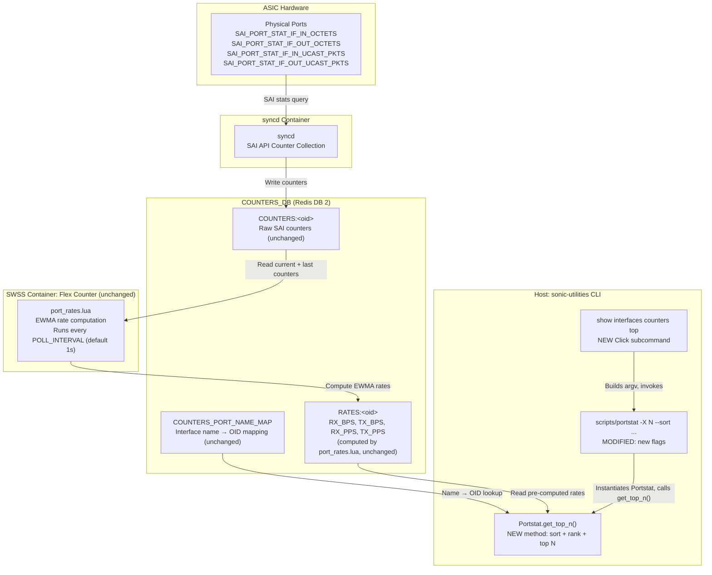
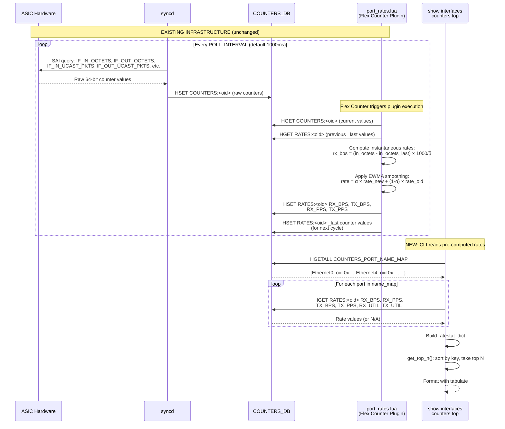
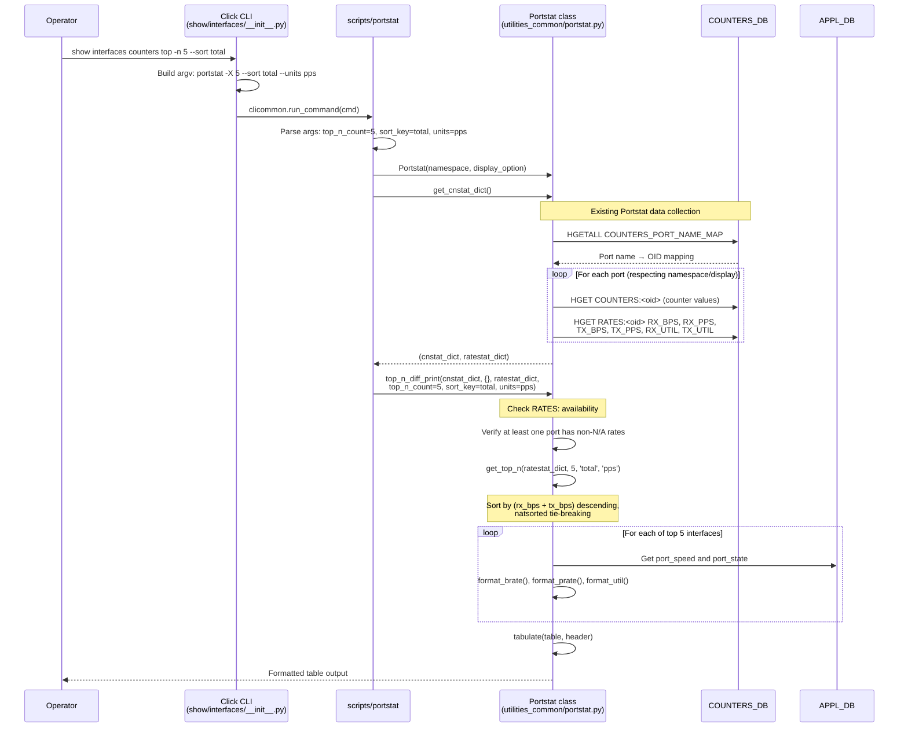
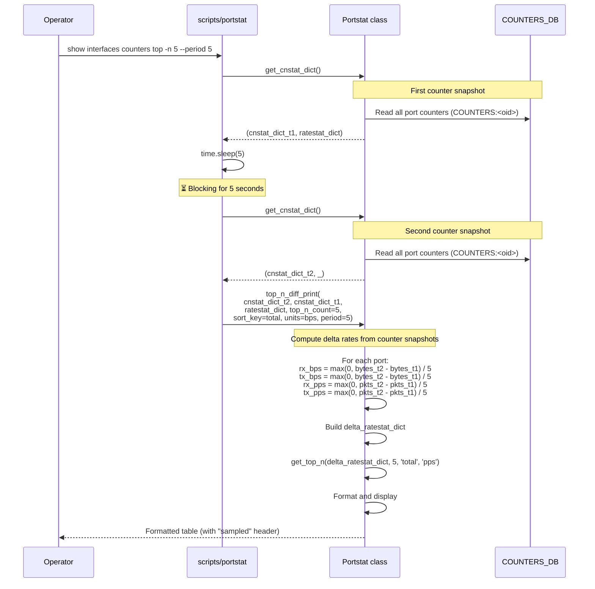

# Top N Interfaces by Traffic in SONiC
# High Level Design Document
### Rev 0.2

# Table of Contents
- [List of Tables](#list-of-tables)
- [List of Figures](#list-of-figures)
- [Revision](#revision)
- [About this Manual](#about-this-manual)
- [Scope](#scope)
- [Definitions/Abbreviation](#definitionsabbreviation)
- [1 Overview](#1-overview)
    - [1.1 Current Limitations](#11-current-limitations)
    - [1.2 Proposed Solution](#12-proposed-solution)
    - [1.3 Design Philosophy](#13-design-philosophy)
- [2 Requirements](#2-requirements)
    - [2.1 Functional Requirements](#21-functional-requirements)
    - [2.2 CLI Requirements](#22-cli-requirements)
    - [2.3 Scalability Requirements](#23-scalability-requirements)
- [3 Architecture Design](#3-architecture-design)
    - [3.1 High-Level Architecture](#31-high-level-architecture)
    - [3.2 SAI Counters Used](#32-sai-counters-used)
    - [3.3 Rate Data Source: The RATES Table](#33-rate-data-source-the-rates-table)
    - [3.4 Why Pre-Computed Rates Beat Sample-and-Diff](#34-why-pre-computed-rates-beat-sample-and-diff)
- [4 Modules Design](#4-modules-design)
    - [4.1 Modules that need to be updated](#41-modules-that-need-to-be-updated)
        - [4.1.1 CLI Entry Point: show interfaces counters top](#411-cli-entry-point-show-interfaces-counters-top)
        - [4.1.2 Script: portstat](#412-script-portstat)
        - [4.1.3 Utility: Portstat class](#413-utility-portstat-class)
- [5 CLI Commands](#5-cli-commands)
    - [5.1 show interfaces counters top](#51-show-interfaces-counters-top)
- [6 Flows](#6-flows)
    - [6.1 General Data Flow](#61-general-data-flow)
    - [6.2 CLI Execution Flow](#62-cli-execution-flow)
    - [6.3 Period Fallback Flow](#63-period-fallback-flow)
- [7 Warmboot and Fastboot Design Impact](#7-warmboot-and-fastboot-design-impact)
- [8 Things to be Considered](#8-things-to-be-considered)
- [9 Testing Requirements](#9-testing-requirements)
    - [9.1 Unit Test Cases: sonic-utilities](#91-unit-test-cases-sonic-utilities)
    - [9.2 System Test Cases](#92-system-test-cases)
- [10 Stretch Goals and Open Questions](#10-stretch-goals-and-open-questions)

# List of Tables
* [Table 1: Revision](#revision)
* [Table 2: Abbreviations](#definitionsabbreviation)
* [Table 3: Why Pre-Computed Rates Beat Sample-and-Diff](#34-why-pre-computed-rates-beat-sample-and-diff)
* [Table 4: Modules to be Updated](#41-modules-that-need-to-be-updated)

# List of Figures
* [Figure 1: High-Level Architecture](#31-high-level-architecture)
* [Figure 2: General Data Flow](#61-general-data-flow)
* [Figure 3: CLI Execution Flow](#62-cli-execution-flow)
* [Figure 4: Period Fallback Flow](#63-period-fallback-flow)
* [Figure 5: Watch Mode Flow](#64-watch-mode-flow)

## Revision
| Rev |     Date    |       Author            | Change Description                |
|:---:|:-----------:|:-----------------------:|-----------------------------------|
| 0.1 | 2026-05-29  | Rishik Yalamanchili     | Initial version (history buffer approach) |
| 0.2 | 2026-06-25  | Rishik Yalamanchili     | Revised: thin filter on Portstat using pre-computed RATES: table |

# About this Manual
This document provides general information about the design and implementation of the `show interfaces counters top` feature in SONiC. This feature enables network operators to instantaneously identify the top N interfaces carrying the highest traffic by leveraging the pre-computed rate values already maintained in the `COUNTERS_DB RATES:` table by the existing `port_rates.lua` Flex Counter plugin.

# Scope
This document describes the high level design of the Top N Interfaces by Traffic feature. It covers:
1. The addition of a `top` subcommand to the existing `show interfaces counters` CLI group within `sonic-utilities`.
2. The extension of the `scripts/portstat` script with new flags for top-N filtering, sorting, and watch mode.
3. The addition of a `get_top_n()` method to the existing `Portstat` class in `utilities_common/portstat.py`.
4. A `--period` fallback mode for Virtual Switch (VS) and test environments where the `port_rates.lua` plugin is not loaded.

No changes are required to `sonic-swss`, `orchagent`, Lua plugins, Config DB, or any daemon. The entire feature is implemented within the `sonic-utilities` repository as a **thin filter** on top of existing infrastructure.

# Definitions/Abbreviation
## Table 2: Abbreviations
| Definitions/Abbreviation | Description                                |
|--------------------------|--------------------------------------------|
| RX                       | Receive / Ingress traffic                  |
| TX                       | Transmit / Egress traffic                  |
| BPS                      | Bytes Per Second (as stored in RATES: table by port_rates.lua) |
| PPS                      | Packets Per Second                         |
| OID                      | SAI Object Identifier                      |
| EWMA                     | Exponential Weighted Moving Average        |

# 1 Overview

SONiC exposes per-interface traffic counters via COUNTERS_DB and provides CLI tools such as `portstat` and `show interfaces counters` to display them. The existing `show interfaces counters rates` command (backed by `portstat -R`) can display current rates for all interfaces, but operators currently lack a mechanism to quickly identify which interfaces are carrying the **highest** traffic at any given time.

In large-scale deployments with hundreds of ports, manually scanning counter output to find congested interfaces is inefficient and error-prone. Operators need a single command that returns the top N busiest interfaces, ranked by throughput, instantaneously.

## 1.1 Current Limitations

The current SONiC rate infrastructure has the following characteristics that inform this design:

1. **No ranking or filtering**: The existing `portstat -R` / `show interfaces counters rates` command displays rates for **all** interfaces in natural sort order. There is no option to sort by traffic volume or limit the output to the top N.

## 1.2 Proposed Solution

This feature introduces `show interfaces counters top` as a **thin filter on top of the existing `Portstat` class**. The design reads the `RATES:<oid>` entries that `orchagent`'s `port_rates.lua` plugin already maintains, sorts them by a user-selected key, and displays the top N results.

**Key properties:**
- **Instantaneous**: Results appear in ~50ms (single Redis read pass), with no blocking delay.
- **Numerically consistent**: The rates shown are identical to those displayed by `show interfaces counters rates`, since both read from the same `RATES:` table.
- **Zero backend changes**: No new daemons, no new DB tables, no Lua script modifications, no orchagent changes.
- **Multi-ASIC and VOQ-chassis aware**: Inherits full multi-ASIC and VOQ chassis support from the existing `Portstat` class.
- **Three files changed**: The entire feature is implemented by modifying three files in `sonic-utilities`.

## 1.3 Design Philosophy

The design follows the principle of **maximum reuse of existing infrastructure**:

```
┌──────────────────────────────────────────────────────────────────┐
│ Existing Infrastructure (unchanged)                              │
│                                                                  │
│   ASIC → syncd → COUNTERS:<oid> → port_rates.lua → RATES:<oid>   │
│                                                                  │
│   Portstat class: get_cnstat_dict() → ratestat_dict              │
│   Portstat class: get_port_state(), get_port_speed()             │
│   netstat.py: format_brate(), format_prate(), format_util()      │
└──────────────────────────────────────────────────────────────────┘
                              │
                    ┌─────────▼──────────┐
                    │ NEW: Thin Filter   │
                    │                    │
                    │ get_top_n()        │
                    │ Sort + Rank + Top  │
                    │ top CLI command    │
                    └────────────────────┘
```

This approach ensures that the `top` command benefits from all existing and future improvements to the rate computation pipeline (e.g., improved EWMA tuning, FEC BER enhancements) without any additional maintenance burden.

# 2 Requirements

## 2.1 Functional Requirements

- The CLI command must return the top N interfaces **instantaneously** by default, leveraging pre-computed rates in the `COUNTERS_DB RATES:` table. There must be no `time.sleep()` or blocking delay under normal operation.

- The interfaces must be rankable by different keys: `total`, `rx`, `tx`, and `util` (utilization).

- The rank must be capable of sorting by `bps` (Bytes per second) or `pps` (Packets per second).

- The default sort key must be `total` throughput (`RX + TX`), and the default unit `pps`.

- The command must provide an optional `--period` flag as a fallback to perform a two-sample delta calculation. This is necessary for Virtual Switch (VS) environments where the `port_rates.lua` plugin is not loaded and the `RATES:` table is unpopulated.

- When the `RATES:` table is empty or all values are `N/A` (indicating the rate plugin is not loaded), and `--period` was not specified, the CLI must print a clear message: `"Rate plugin not loaded, try --period 5 for sampled mode"` rather than silently displaying a table of zeros.

- The CLI must be capable of producing JSON formatted output for automation systems.

- The output should provide deterministic tie-breaking for interfaces with identical rates (e.g., multiple interfaces with 0 bps should be naturally sorted by name using `natsorted`).

- The command must be consistent with the existing `show interfaces counters` CLI tree and share the same `--namespace` and `--display` (all|frontend) options for multi-ASIC support.

## 2.2 CLI Requirements

A new CLI command will be introduced as a subcommand of `show interfaces counters`:

```
show interfaces counters top [OPTIONS]

Options:
  -n, --count INTEGER          Number of top interfaces to show. Default: 5.
  --sort [rx|tx|total|util]    Sort key. Default: total.
  --units [bps|pps]            Rank by bytes/sec or packets/sec. Default: pps.
  -w, --watch INTEGER          Refresh every N seconds. Default: off.
  -p, --period INTEGER         Two-sample delta fallback for environments without RATES:. Default: off.
  -j, --json                   JSON output.
  -s, --display TEXT           all|frontend Default: frontend.
  --namespace TEXT              Restrict to namespace.
  --verbose                    Print the underlying command.
```

**Design decisions for the CLI surface:**

1. **Placement under `counters`**: The command is placed at `show interfaces counters top` rather than `show interfaces top`. This is consistent with the existing CLI tree where all counter-related views (`rates`, `errors`, `fec-stats`, `trim`, `detailed`) are subcommands of `counters`.

2. **`--count` vs positional argument**: The count is an option (`-n 10`) rather than a positional argument to maintain consistency with the other portstat-based subcommands and to allow a sensible default of 5.

3. **`--watch` vs external `watch`**: A native `--watch` flag is provided rather than requiring users to use the external `watch` command. This ensures consistent behavior and allows the script to properly handle terminal clearing and header re-rendering.

## 2.3 Scalability Requirements

- The command execution time must remain sub-second regardless of the number of ports, as it performs a single pass through the `ratestat_dict` already loaded in memory by `Portstat.get_cnstat_dict()`.

- The sorting operation is `O(N log N)` where N is the number of ports. For a 512-port system, this is negligible (~500 comparisons).

- No additional Redis operations are introduced beyond what `Portstat.get_cnstat_dict()` already performs. The `top` filter is a pure Python in-memory operation on the data already fetched.

- The `--watch` mode re-fetches data from COUNTERS_DB on each cycle, which is the same cost as running the command once. The minimum watch interval should be at least 1 second to avoid unnecessary Redis load.

# 3 Architecture Design

## 3.1 High-Level Architecture

The feature relies on a read-only consumer model. The new CLI command simply reads the data it already produces and applies a sort-and-filter operation.



**Architecture summary:**
- The architecture diagram is **read-only from the CLI's perspective**. Everything to the left of the "Host: sonic-utilities CLI" box is existing infrastructure that remains completely unchanged.

## 3.2 SAI Counters Used

The feature relies on the same SAI counters already polled by the existing `port_rates.lua` plugin. **No new SAI API calls are required.**

| SAI Counter                               | Description                                     | Used for            |
|-------------------------------------------|-------------------------------------------------|---------------------|
| SAI_PORT_STAT_IF_IN_OCTETS                | Total bytes received on the port (64-bit)       | RX_BPS computation  |
| SAI_PORT_STAT_IF_OUT_OCTETS               | Total bytes transmitted on the port (64-bit)    | TX_BPS computation  |
| SAI_PORT_STAT_IF_IN_UCAST_PKTS           | Unicast packets received                        | RX_PPS computation  |
| SAI_PORT_STAT_IF_IN_NON_UCAST_PKTS      | Non-unicast packets received                    | RX_PPS computation  |
| SAI_PORT_STAT_IF_OUT_UCAST_PKTS          | Unicast packets transmitted                     | TX_PPS computation  |
| SAI_PORT_STAT_IF_OUT_NON_UCAST_PKTS     | Non-unicast packets transmitted                 | TX_PPS computation  |

These counters are polled by `syncd`, written to `COUNTERS:<oid>`, and then consumed by `port_rates.lua` to compute the EWMA-smoothed rate values stored in `RATES:<oid>`. The `top` command reads only the final `RATES:<oid>` values.

## 3.3 Rate Data Source: The RATES Table

The `RATES:<oid>` hash in COUNTERS_DB is populated by the `port_rates.lua` Flex Counter plugin on every polling cycle. The relevant fields are:

```
Key:     RATES:<oid>
Type:    Redis HASH
Fields:
    RX_BPS    = <float>     ; EWMA-smoothed receive bytes per second
    TX_BPS    = <float>     ; EWMA-smoothed transmit bytes per second
    RX_PPS    = <float>     ; EWMA-smoothed receive packets per second
    TX_PPS    = <float>     ; EWMA-smoothed transmit packets per second
    RX_UTIL   = <float>     ; Receive utilization percentage (platform-dependent)
    TX_UTIL   = <float>     ; Transmit utilization percentage (platform-dependent)
```

Where `<oid>` is the SAI Object Identifier from `COUNTERS_PORT_NAME_MAP` (e.g., `oid:0x1000000000012`).

**EWMA smoothing:**

The rate values are smoothed using an Exponential Weighted Moving Average (EWMA) to reduce noise from bursty traffic:

```
rate_smoothed = α × rate_new + (1 - α) × rate_old
```

Where:
- `α` (alpha) is the smoothing factor, configured via `RATES:PORT:PORT_ALPHA` in COUNTERS_DB
- `rate_new` is the instantaneous rate computed from the counter delta in the current polling cycle
- `rate_old` is the previously stored smoothed rate

**Utilization note:**

### Note: Need to reverify this UTIL PART later!

The `RX_UTIL` and `TX_UTIL` fields are **not** set by the standard `port_rates.lua` plugin. When these fields are `N/A`, the CLI computes utilization from `RX_BPS` and the port speed:

```
utilization_pct = (bps_value) / (port_speed_mbps × 1,000,000 / 8) × 100
```

This fallback is already implemented in the existing `Portstat.cnstat_diff_print()` method and the `format_util()` function in `utilities_common/netstat.py`.

## 3.4 Why Pre-Computed Rates Beat Sample-and-Diff

| Concern | `RATES:` table (primary) | Two-sample delta (`--period`) |
|---|---|---|
| Latency to first result | ~50 ms (single Redis read) | `--period` seconds blocking |
| Numerical consistency with `show interfaces counters rates` | **Identical** (same source) | Different (no EWMA smoothing) |
| Orchagent load | Zero added | Zero added |
| Management-plane CPU | Negligible | Two full counter scans |
| Behavior during port flap | Handled by orchagent (EWMA dampens spikes) | Possible huge spike if flap occurs between samples |
| Requires Lua plugin loaded | **Yes** | No |
| Works on Virtual Switch (VS) | **No** (needs `--period` fallback) | Yes |

The `--period N` fallback covers the one case the primary mechanism misses: Virtual Switch or unit-test environments where the `port_rates.lua` plugin isn't loaded. Detection is straightforward: if `ratestat_dict` is empty or all rates are `N/A` after one read, the CLI prints a clear message: `"Rate plugin not loaded, try --period 5 for sampled mode"` and offers the fallback.

# 4 Modules Design

## 4.1 Modules that need to be updated

The following table summarizes all components that require modification or creation. All changes are within the `sonic-utilities` repository.

| Module / File | Repository | Action |
|---|---|---|
| `show/interfaces/__init__.py` | sonic-utilities | **Modify**: add `top` Click subcommand to `counters` group |
| `scripts/portstat` | sonic-utilities | **Modify**: add `-X/--top_n`, `--sort`, `--units`, `-w/--watch` flags |
| `utilities_common/portstat.py` | sonic-utilities | **Modify**: add `get_top_n()` method and `top_n_diff_print()` method |
| `tests/portstat_top_n_test.py` | sonic-utilities | **New**: unit tests for the top-N feature |

**No changes required in:**
- `sonic-swss` (no orchagent, no Lua plugin, no flexcounterorch changes)
- `counterpoll` (no new counter groups)
- Config DB (no new schema)
- COUNTERS_DB (no new key families)


### 4.1.1 CLI Entry Point: show interfaces counters top

In `sonic-utilities/show/interfaces/__init__.py`, a new `top` subcommand is added to the existing `counters` Click group. This follows the exact same pattern used by the existing `rates`, `errors`, `fec-stats`, `trim`, and `detailed` subcommands. Each one builds a `portstat` command-line and delegates to `clicommon.run_command()`.

```python
# 'top' subcommand ("show interfaces counters top")
@counters.command()
@multi_asic_util.multi_asic_click_options
@click.option('-n', '--count', type=click.IntRange(1, 500), default=5,
              help='Number of top interfaces to show. Default: 5.')
@click.option('--sort', type=click.Choice(['rx', 'tx', 'total', 'util']),
              default='total', help='Sort key. Default: total.')
@click.option('--units', type=click.Choice(['bps', 'pps']),
              default='pps', help='Rank by bytes/sec or packets/sec. Default: pps.')
@click.option('-w', '--watch', type=click.IntRange(1, 3600), default=None,
              help='Refresh every N seconds. Default: off.')
@click.option('-p', '--period', type=click.INT, default=None,
              help='Two-sample delta fallback for environments without RATES:. Default: off.')
@click.option('-j', '--json', 'json_fmt', is_flag=True, help='JSON output.')
@click.option('--verbose', is_flag=True, help='Enable verbose output')
def top(namespace, display, count, sort, units, watch, period, json_fmt, verbose):
    """Show top N interfaces by traffic rate"""

    cmd = ['portstat', '-X', str(count), '--sort', sort, '--units', units]

    if period is not None:
        cmd += ['-p', str(period)]
    if watch is not None:
        cmd += ['-w', str(watch)]
    if json_fmt:
        cmd += ['-j']

    cmd += ['-s', str(display)]
    if namespace is not None:
        cmd += ['-n', str(namespace)]

    clicommon.run_command(cmd, display_cmd=verbose)
```

**Key design decision:** The `top` Click command does NOT implement any sorting logic itself. It builds the appropriate `portstat` command-line arguments and delegates all work to the `portstat` script. This is consistent with how `show interfaces counters rates` delegates to `portstat -R`, and `show interfaces counters errors` delegates to `portstat -e`.


### 4.1.2 Script: portstat

In `sonic-utilities/scripts/portstat`, the following new arguments are added to the `argparse` parser:

```python
# New arguments for top-N feature
parser.add_argument('-X', '--top_n', type=int, default=0,
                    help='Show top N interfaces by traffic rate.')
parser.add_argument('--sort', type=str, default='total',
                    choices=['rx', 'tx', 'total', 'util'],
                    help='Sort key for top-N mode. Default: total.')
parser.add_argument('--units', type=str, default='pps',
                    choices=['bps', 'pps'],
                    help='Rank by bytes/sec or packets/sec for top-N mode. Default: pps.')
parser.add_argument('-w', '--watch', type=int, default=0,
                    help='Refresh top display every N seconds.')
```

The main function is extended with the following logic after the existing argument parsing:

```python
top_n_count = args.top_n
sort_key = args.sort
units = args.units
watch_interval = args.watch

if top_n_count > 0:
    if watch_interval > 0:
        # Watch mode: loop with periodic refresh
        try:
            while True:
                portstat = Portstat(namespace, display_option)
                cnstat_dict, ratestat_dict = portstat.get_cnstat_dict()

                if wait_time_in_seconds > 0:
                    # --period mode: two-sample delta
                    time.sleep(wait_time_in_seconds)
                    cnstat_new_dict, _ = portstat.get_cnstat_dict()
                    portstat.top_n_diff_print(
                        cnstat_new_dict, cnstat_dict, ratestat_dict,
                        top_n_count, sort_key, units, use_json,
                        period=wait_time_in_seconds
                    )
                else:
                    portstat.top_n_diff_print(
                        cnstat_dict, {}, ratestat_dict,
                        top_n_count, sort_key, units, use_json
                    )

                time.sleep(watch_interval)
                # Clear screen for next refresh
                os.system('clear' if os.name == 'posix' else 'cls')
        except KeyboardInterrupt:
            sys.exit(0)
    else:
        # Single-shot mode
        portstat = Portstat(namespace, display_option)
        cnstat_dict, ratestat_dict = portstat.get_cnstat_dict()

        if wait_time_in_seconds > 0:
            # --period mode: two-sample delta
            time.sleep(wait_time_in_seconds)
            cnstat_new_dict, _ = portstat.get_cnstat_dict()
            portstat.top_n_diff_print(
                cnstat_new_dict, cnstat_dict, ratestat_dict,
                top_n_count, sort_key, units, use_json,
                period=wait_time_in_seconds
            )
        else:
            portstat.top_n_diff_print(
                cnstat_dict, {}, ratestat_dict,
                top_n_count, sort_key, units, use_json
            )

    sys.exit(0)
```

**Note on `os` import:** The `os` module is already imported in `scripts/portstat` (line 11: `import os.path`). For the `clear` call, `import os` is needed; this is already available since `os.path` is a submodule of `os`.


### 4.1.3 Utility: Portstat class

In `sonic-utilities/utilities_common/portstat.py`, two new methods are added to the `Portstat` class:

**1. `get_top_n()`: Sort and rank interfaces**

```python
def get_top_n(self, ratestat_dict, n, sort_key='total', units='pps'):
    """
    Sort interfaces by the specified rate key and return the top N.

    Args:
        ratestat_dict: OrderedDict mapping port_name -> RateStats namedtuple
        n: Number of top interfaces to return
        sort_key: 'rx', 'tx', 'total', or 'util'
        units: 'bps' or 'pps'

    Returns:
        List of (port_name, RateStats) tuples, sorted descending by the
        specified key, with natsorted tie-breaking for deterministic output.
    """

    def safe_float(value):
        """Convert a rate value to float, treating N/A as 0."""
        if value == STATUS_NA:
            return 0.0
        return float(value)

    def sort_value(port_name, rates):
        """Compute the numeric sort value for a given interface."""
        if sort_key == 'total':
            if units == 'bps':
                return safe_float(rates.rx_bps) + safe_float(rates.tx_bps)
            else:  # pps
                return safe_float(rates.rx_pps) + safe_float(rates.tx_pps)
        elif sort_key == 'rx':
            if units == 'bps':
                return safe_float(rates.rx_bps)
            else:
                return safe_float(rates.rx_pps)
        elif sort_key == 'tx':
            if units == 'bps':
                return safe_float(rates.tx_bps)
            else:
                return safe_float(rates.tx_pps)
        elif sort_key == 'util':
            # Utilization: use rx_util + tx_util if available,
            # otherwise compute from BPS and port speed
            rx_u = safe_float(rates.rx_util)
            tx_u = safe_float(rates.tx_util)
            if rates.rx_util == STATUS_NA:
                port_speed = self.get_port_speed(port_name)
                if port_speed != STATUS_NA and port_speed > 0:
                    rx_u = safe_float(rates.rx_bps) / (float(port_speed) * 1_000_000 / 8.0) * 100
                else:
                    rx_u = 0.0
            if rates.tx_util == STATUS_NA:
                port_speed = self.get_port_speed(port_name)
                if port_speed != STATUS_NA and port_speed > 0:
                    tx_u = safe_float(rates.tx_bps) / (float(port_speed) * 1_000_000 / 8.0) * 100
                else:
                    tx_u = 0.0
            return rx_u + tx_u
        return 0.0

    # Filter out non-interface keys (e.g., 'time')
    interfaces = [(k, v) for k, v in ratestat_dict.items() if k != 'time']

    # Sort by rate value descending, then by name (natsorted) for deterministic ties
    from natsort import natsort_keygen
    natsort_key = natsort_keygen()

    sorted_interfaces = sorted(
        interfaces,
        key=lambda item: (-sort_value(item[0], item[1]), natsort_key(item[0]))
    )

    return sorted_interfaces[:n]
```

**Key design decisions for `get_top_n()`:**

1. **`safe_float()` helper**: The `RATES:` table may contain `N/A` values when the rate plugin has not yet initialized or when a specific field is not supported by the platform. All `N/A` values are treated as `0.0` for sorting purposes.

2. **Utilization fallback**: When `RX_UTIL` / `TX_UTIL` are `N/A` (which is the common case since `port_rates.lua` does not set these fields), utilization is computed on-the-fly from `RX_BPS` and the port speed. This mirrors the existing behavior in `cnstat_diff_print()`.

3. **`natsort` tie-breaking**: When multiple interfaces have the same rate value (e.g., multiple idle interfaces at 0 bps), they are ordered by natural sort order of the interface name. This ensures `Ethernet2` appears before `Ethernet10`, and the output is deterministic across runs. The `natsort` library is already imported in `portstat.py`.

4. **No mutation**: The method does not modify `ratestat_dict`. It creates a new sorted list and returns a slice.


**2. `top_n_diff_print()`: Format and display the top N table**

```python
def top_n_diff_print(self, cnstat_new_dict, cnstat_old_dict, ratestat_dict,
                    top_n_count, sort_key, units, use_json, period=None):
    """
    Display the top N interfaces ranked by the specified rate key.

    In normal mode (no --period), rates come from the RATES: table.
    In period mode (--period N), rates are computed from counter deltas.

    Args:
        cnstat_new_dict: Current counter stats (used for --period mode)
        cnstat_old_dict: Previous counter stats (used for --period mode)
        ratestat_dict: Rate stats from RATES: table
        top_n_count: Number of top interfaces to display
        sort_key: 'rx', 'tx', 'total', or 'util'
        units: 'bps' or 'pps'
        use_json: Whether to output JSON
        period: If set, the --period interval in seconds (triggers delta mode)
    """
    import datetime

    # Check if RATES: table is populated (not all N/A)
    rates_available = False
    for port_name, rates in ratestat_dict.items():
        if port_name == 'time':
            continue
        if rates.rx_bps != STATUS_NA or rates.tx_bps != STATUS_NA:
            rates_available = True
            break

    if not rates_available and period is None:
        print("Rate plugin not loaded, the RATES: table is empty or all N/A.")
        print("This typically occurs on Virtual Switch (VS) environments")
        print("where the port_rates.lua plugin is not running.")
        print("")
        print("To use sampled mode instead, try:")
        print("    show interfaces counters top --period 5")
        return

    # If --period is specified, compute rates from counter deltas
    if period is not None and cnstat_old_dict:
        delta_ratestat = OrderedDict()
        for port_name in cnstat_new_dict:
            if port_name == 'time':
                continue
            if port_name not in cnstat_old_dict:
                continue

            new_cntr = cnstat_new_dict[port_name]
            old_cntr = cnstat_old_dict[port_name]

            # Compute byte rates from octets delta
            rx_bytes_new = int(new_cntr.get('rx_byt', 0) if new_cntr.get('rx_byt') != STATUS_NA else 0)
            rx_bytes_old = int(old_cntr.get('rx_byt', 0) if old_cntr.get('rx_byt') != STATUS_NA else 0)
            tx_bytes_new = int(new_cntr.get('tx_byt', 0) if new_cntr.get('tx_byt') != STATUS_NA else 0)
            tx_bytes_old = int(old_cntr.get('tx_byt', 0) if old_cntr.get('tx_byt') != STATUS_NA else 0)

            rx_bps = max(0, rx_bytes_new - rx_bytes_old) / period
            tx_bps = max(0, tx_bytes_new - tx_bytes_old) / period

            # Compute packet rates from packet counter deltas
            rx_pkts_new = int(new_cntr.get('rx_ok', 0) if new_cntr.get('rx_ok') != STATUS_NA else 0)
            rx_pkts_old = int(old_cntr.get('rx_ok', 0) if old_cntr.get('rx_ok') != STATUS_NA else 0)
            tx_pkts_new = int(new_cntr.get('tx_ok', 0) if new_cntr.get('tx_ok') != STATUS_NA else 0)
            tx_pkts_old = int(old_cntr.get('tx_ok', 0) if old_cntr.get('tx_ok') != STATUS_NA else 0)

            rx_pps = max(0, rx_pkts_new - rx_pkts_old) / period
            tx_pps = max(0, tx_pkts_new - tx_pkts_old) / period

            delta_ratestat[port_name] = RateStats._make([
                rx_bps, rx_pps, STATUS_NA, tx_bps, tx_pps, STATUS_NA,
                STATUS_NA, STATUS_NA, STATUS_NA, STATUS_NA, STATUS_NA, STATUS_NA, STATUS_NA
            ])

        ratestat_dict = delta_ratestat

    # Get top N interfaces
    top_interfaces = self.get_top_n(ratestat_dict, top_n_count, sort_key, units)

    if not top_interfaces:
        print("No interfaces found.")
        return

    # Build output
    now = datetime.datetime.now()

    if use_json:
        json_output = {
            "sampled_at": now.isoformat(),
            "sort_key": "{}_{}".format(sort_key, units),
            "count": len(top_interfaces),
            "interfaces": []
        }
        if period is not None:
            json_output["period_seconds"] = period
            json_output["mode"] = "sampled"
        else:
            json_output["mode"] = "pre-computed (EWMA)"

        for rank, (port_name, rates) in enumerate(top_interfaces, 1):
            port_speed = self.get_port_speed(port_name)
            entry = {
                "rank": rank,
                "iface": port_name,
                "state": self.get_port_state(port_name),
                "rx_bps": float(rates.rx_bps) if rates.rx_bps != STATUS_NA else None,
                "rx_pps": float(rates.rx_pps) if rates.rx_pps != STATUS_NA else None,
                "tx_bps": float(rates.tx_bps) if rates.tx_bps != STATUS_NA else None,
                "tx_pps": float(rates.tx_pps) if rates.tx_pps != STATUS_NA else None,
            }
            # Add utilization if port speed is available
            if port_speed != STATUS_NA and port_speed > 0:
                rx_bps_val = float(rates.rx_bps) if rates.rx_bps != STATUS_NA else 0
                tx_bps_val = float(rates.tx_bps) if rates.tx_bps != STATUS_NA else 0
                entry["rx_util_pct"] = rx_bps_val / (float(port_speed) * 1_000_000 / 8.0) * 100
                entry["tx_util_pct"] = tx_bps_val / (float(port_speed) * 1_000_000 / 8.0) * 100

            json_output["interfaces"].append(entry)

        import json
        print(json.dumps(json_output, indent=4))
    else:
        # Human-readable table output
        if period is not None:
            print("Sampled at {}  (rates computed from {}-second counter delta)".format(
                now.strftime("%Y-%m-%d %H:%M:%S"), period))
        else:
            print("Sampled at {}  (rates pre-smoothed by orchagent, EWMA)".format(
                now.strftime("%Y-%m-%d %H:%M:%S")))
        print("")

        header = ['RANK', 'IFACE', 'STATE', 'RX_BPS', 'RX_PPS', 'TX_BPS', 'TX_PPS', 'TOTAL_BPS', 'TOTAL_PPS', 'UTIL']
        table = []

        for rank, (port_name, rates) in enumerate(top_interfaces, 1):
            port_speed = self.get_port_speed(port_name)

            rx_util_str = format_util(rates.rx_bps, port_speed) \
                if rates.rx_util == STATUS_NA else format_util_directly(rates.rx_util)
            tx_util_str = format_util(rates.tx_bps, port_speed) \
                if rates.tx_util == STATUS_NA else format_util_directly(rates.tx_util)

            # For the UTIL column, show the combined or max utilization
            if rx_util_str == STATUS_NA and tx_util_str == STATUS_NA:
                util_display = STATUS_NA
            else:
                # Parse percentage values for display
                rx_pct = float(rx_util_str.rstrip('%')) if rx_util_str != STATUS_NA else 0
                tx_pct = float(tx_util_str.rstrip('%')) if tx_util_str != STATUS_NA else 0
                util_display = "{:.2f}%".format(max(rx_pct, tx_pct))

            total_bps = safe_float(rates.rx_bps) + safe_float(rates.tx_bps)
            total_pps = safe_float(rates.rx_pps) + safe_float(rates.tx_pps)
            total_bps_str = format_brate(total_bps) if rates.rx_bps != STATUS_NA or rates.tx_bps != STATUS_NA else STATUS_NA
            total_pps_str = format_prate(total_pps) if rates.rx_pps != STATUS_NA or rates.tx_pps != STATUS_NA else STATUS_NA

            table.append((
                rank,
                port_name,
                self.get_port_state(port_name),
                format_brate(rates.rx_bps),
                format_prate(rates.rx_pps),
                format_brate(rates.tx_bps),
                format_prate(rates.tx_pps),
                total_bps_str,
                total_pps_str,
                util_display
            ))

        print(tabulate(table, header, tablefmt='simple', stralign='right'))
```

**Key design decisions for `top_n_diff_print()`:**

1. **RATES: availability check**: Before displaying results, the method checks if at least one interface has non-`N/A` rate values. If all are `N/A`, it prints an actionable error message directing the user to `--period` mode.

2. **`--period` delta computation**: When `--period` is specified, the method computes raw counter deltas (bytes/period, pkts/period) from the `cnstat_dict` and creates a synthetic `ratestat_dict`. This bypasses the EWMA-smoothed `RATES:` table entirely. The `MAX(0, ...)` clamping protects against 64-bit counter wraps.

3. **Reuse of existing formatters**: The method reuses `format_brate()`, `format_prate()`, and `format_util()` from `utilities_common/netstat.py`, which are the exact same functions used by the existing `portstat -R` display. This ensures visual consistency with `show interfaces counters rates`.

4. **UTIL column**: The `UTIL` column shows the maximum of RX and TX utilization for the interface. This represents the "bottleneck" direction. The JSON output provides both `rx_util_pct` and `tx_util_pct` separately for consumers that need directional utilization.

5. **JSON structure**: The JSON output includes metadata (`sampled_at`, `sort_key`, `mode`) and a flat array of interface objects. The `mode` field indicates whether rates are from pre-computed EWMA or from sampled deltas, which is important for consumers interpreting the data.

**3. Necessary import additions at the top of `portstat.py`:**

```python
# These are already imported in the file, listed here for completeness:
# from collections import OrderedDict, namedtuple
# from natsort import natsorted
# from tabulate import tabulate
# No new imports required.
```

**4. Registration note:**

No changes are needed in `show/interfaces/__init__.py` beyond the Click command definition in §4.1.1. The `top` command is automatically registered as a subcommand of `counters` by the `@counters.command()` decorator.

# 5 CLI Commands

## 5.1 show interfaces counters top

### Basic usage: show top 5 interfaces (default)

```bash
admin@sonic:~$ show interfaces counters top
Sampled at 2026-06-25 10:14:03  (rates pre-smoothed by orchagent, EWMA)

  RANK  IFACE          STATE      RX_BPS       RX_PPS      TX_BPS       TX_PPS    TOTAL_BPS     TOTAL_PPS     UTIL
------  -----------  -------  ----------  -----------  ----------  -----------  -----------  ------------  -------
     1  Ethernet120        U  852.13 MB/s  1047000.00/s  783.22 MB/s  962500.00/s  1635.35 MB/s  2009500.00/s  85.21%
     2  Ethernet112        U  621.09 MB/s   763000.00/s  598.04 MB/s  735000.00/s  1219.13 MB/s  1498000.00/s  62.11%
     3  Ethernet64         U  482.01 MB/s   593000.00/s  521.57 MB/s  641000.00/s  1003.58 MB/s  1234000.00/s  52.16%
     4  Ethernet0          U  321.55 MB/s   395000.00/s  301.23 MB/s  370000.00/s   622.78 MB/s   765000.00/s  32.15%
     5  Ethernet48         U  211.06 MB/s   259000.00/s  198.92 MB/s  244500.00/s   409.98 MB/s   503500.00/s  21.11%
```

### Custom count

```bash
admin@sonic:~$ show interfaces counters top -n 3
Sampled at 2026-06-25 10:14:05  (rates pre-smoothed by orchagent, EWMA)

  RANK  IFACE          STATE      RX_BPS       RX_PPS      TX_BPS       TX_PPS    TOTAL_BPS     TOTAL_PPS     UTIL
------  -----------  -------  ----------  -----------  ----------  -----------  -----------  ------------  -------
     1  Ethernet120        U  852.13 MB/s  1047000.00/s  783.22 MB/s  962500.00/s  1635.35 MB/s  2009500.00/s  85.21%
     2  Ethernet112        U  621.09 MB/s   763000.00/s  598.04 MB/s  735000.00/s  1219.13 MB/s  1498000.00/s  62.11%
     3  Ethernet64         U  482.01 MB/s   593000.00/s  521.57 MB/s  641000.00/s  1003.58 MB/s  1234000.00/s  52.16%
```

### Sort by RX traffic

```bash
admin@sonic:~$ show interfaces counters top -n 5 --sort rx
Sampled at 2026-06-25 10:14:10  (rates pre-smoothed by orchagent, EWMA)

  RANK  IFACE          STATE      RX_BPS       RX_PPS      TX_BPS       TX_PPS    TOTAL_BPS     TOTAL_PPS     UTIL
------  -----------  -------  ----------  -----------  ----------  -----------  -----------  ------------  -------
     1  Ethernet120        U  852.13 MB/s  1047000.00/s  783.22 MB/s  962500.00/s  1635.35 MB/s  2009500.00/s  85.21%
     2  Ethernet112        U  621.09 MB/s   763000.00/s  598.04 MB/s  735000.00/s  1219.13 MB/s  1498000.00/s  62.11%
     3  Ethernet64         U  482.01 MB/s   593000.00/s  521.57 MB/s  641000.00/s  1003.58 MB/s  1234000.00/s  52.16%
     4  Ethernet0          U  321.55 MB/s   395000.00/s  301.23 MB/s  370000.00/s   622.78 MB/s   765000.00/s  32.15%
     5  Ethernet48         U  211.06 MB/s   259000.00/s  198.92 MB/s  244500.00/s   409.98 MB/s   503500.00/s  21.11%
```

### Sort by utilization

```bash
admin@sonic:~$ show interfaces counters top -n 5 --sort util
Sampled at 2026-06-25 10:14:15  (rates pre-smoothed by orchagent, EWMA)

  RANK  IFACE          STATE      RX_BPS       RX_PPS      TX_BPS       TX_PPS    TOTAL_BPS     TOTAL_PPS     UTIL
------  -----------  -------  ----------  -----------  ----------  -----------  -----------  ------------  -------
     1  Ethernet120        U  852.13 MB/s  1047000.00/s  783.22 MB/s  962500.00/s  1635.35 MB/s  2009500.00/s  85.21%
     2  Ethernet112        U  621.09 MB/s   763000.00/s  598.04 MB/s  735000.00/s  1219.13 MB/s  1498000.00/s  62.11%
     3  Ethernet64         U  482.01 MB/s   593000.00/s  521.57 MB/s  641000.00/s  1003.58 MB/s  1234000.00/s  52.16%
     4  Ethernet0          U  321.55 MB/s   395000.00/s  301.23 MB/s  370000.00/s   622.78 MB/s   765000.00/s  32.15%
     5  Ethernet48         U  211.06 MB/s   259000.00/s  198.92 MB/s  244500.00/s   409.98 MB/s   503500.00/s  21.11%
```

### Rank by packets per second

```bash
admin@sonic:~$ show interfaces counters top -n 3 --units pps
Sampled at 2026-06-25 10:14:20  (rates pre-smoothed by orchagent, EWMA)

  RANK  IFACE          STATE      RX_BPS       RX_PPS      TX_BPS       TX_PPS    TOTAL_BPS     TOTAL_PPS     UTIL
------  -----------  -------  ----------  -----------  ----------  -----------  -----------  ------------  -------
     1  Ethernet120        U  852.13 MB/s  1047000.00/s  783.22 MB/s  962500.00/s  1635.35 MB/s  2009500.00/s  85.21%
     2  Ethernet8          U   13.37 MB/s   900000.00/s    1.35 MB/s  800000.00/s    14.72 MB/s  1700000.00/s    N/A
     3  Ethernet112        U  621.09 MB/s   763000.00/s  598.04 MB/s  735000.00/s  1219.13 MB/s  1498000.00/s  62.11%
```

Note: When sorting by PPS, Ethernet8 (which has many small packets at high PPS but lower BPS) may rank higher than interfaces with higher byte rates but fewer, larger packets.


### JSON output

```bash
admin@sonic:~$ show interfaces counters top -n 3 --json
{
    "sampled_at": "2026-06-25T10:14:25.118000",
    "sort_key": "total_bps",
    "count": 3,
    "mode": "pre-computed (EWMA)",
    "interfaces": [
        {
            "rank": 1,
            "iface": "Ethernet120",
            "state": "U",
            "rx_bps": 852130000.0,
            "rx_pps": 1047000.0,
            "tx_bps": 783220000.0,
            "tx_pps": 962500.0,
            "total_bps": 1635350000.0,
            "total_pps": 2009500.0,
            "rx_util_pct": 68.17,
            "tx_util_pct": 62.66
        },
        {
            "rank": 2,
            "iface": "Ethernet112",
            "state": "U",
            "rx_bps": 621090000.0,
            "rx_pps": 763000.0,
            "tx_bps": 598040000.0,
            "tx_pps": 735000.0,
            "total_bps": 1219130000.0,
            "total_pps": 1498000.0,
            "rx_util_pct": 49.69,
            "tx_util_pct": 47.84
        },
        {
            "rank": 3,
            "iface": "Ethernet64",
            "state": "U",
            "rx_bps": 482010000.0,
            "rx_pps": 593000.0,
            "tx_bps": 521570000.0,
            "tx_pps": 641000.0,
            "total_bps": 1003580000.0,
            "total_pps": 1234000.0,
            "rx_util_pct": 38.56,
            "tx_util_pct": 41.73
        }
    ]
}
```

### Watch mode

```bash
admin@sonic:~$ show interfaces counters top -n 5 --watch 2
```

The screen clears and refreshes every 2 seconds. Output is identical to the basic usage but with a continuously updating timestamp. Press `Ctrl+C` to exit.


### Period fallback (for VS environments)

```bash
admin@sonic:~$ show interfaces counters top -n 5 --period 5
```

The CLI blocks for 5 seconds, takes two counter snapshots, computes the delta, and displays the top 5 interfaces:

```
Sampled at 2026-06-25 10:14:35  (rates computed from 5-second counter delta)

  RANK  IFACE          STATE      RX_BPS       RX_PPS      TX_BPS       TX_PPS    TOTAL_BPS     TOTAL_PPS     UTIL
------  -----------  -------  ----------  -----------  ----------  -----------  -----------  ------------  -------
     1  Ethernet120        U  850.00 MB/s  1045000.00/s  780.00 MB/s  960000.00/s  1630.00 MB/s  2005000.00/s    N/A
     2  Ethernet112        U  620.00 MB/s   762000.00/s  597.00 MB/s  734000.00/s  1217.00 MB/s  1496000.00/s    N/A
     3  Ethernet64         U  480.00 MB/s   591000.00/s  520.00 MB/s  640000.00/s  1000.00 MB/s  1231000.00/s    N/A
     4  Ethernet0          U  320.00 MB/s   394000.00/s  300.00 MB/s  369000.00/s   620.00 MB/s   763000.00/s    N/A
     5  Ethernet48         U  210.00 MB/s   258000.00/s  198.00 MB/s  244000.00/s   408.00 MB/s   502000.00/s    N/A
```

Note: In `--period` mode, UTIL is `N/A` because port speed information is needed for utilization calculation, and the delta computation does not provide utilization data. This is a known limitation of the fallback mode.


### When rate plugin is not loaded (and no --period)

```bash
admin@sonic:~$ show interfaces counters top
Rate plugin not loaded, the RATES: table is empty or all N/A.
This typically occurs on Virtual Switch (VS) environments
where the port_rates.lua plugin is not running.

To use sampled mode instead, try:
    show interfaces counters top --period 5
```


### All interfaces have zero traffic

```bash
admin@sonic:~$ show interfaces counters top -n 3
Sampled at 2026-06-25 10:14:40  (rates pre-smoothed by orchagent, EWMA)

  RANK  IFACE          STATE      RX_BPS     RX_PPS      TX_BPS     TX_PPS    TOTAL_BPS      TOTAL_PPS     UTIL
------  -----------  -------  ----------  ---------  ----------  ---------  -----------  -------------  -------
     1  Ethernet0          U    0.00 B/s     0.00/s    0.00 B/s     0.00/s     0.00 B/s         0.00/s   0.00%
     2  Ethernet4          U    0.00 B/s     0.00/s    0.00 B/s     0.00/s     0.00 B/s         0.00/s   0.00%
     3  Ethernet8          U    0.00 B/s     0.00/s    0.00 B/s     0.00/s     0.00 B/s         0.00/s   0.00%
```

Note: Interfaces with identical (zero) rates are tie-broken by natural sort order of the interface name.


### Multi-ASIC namespace filtering

```bash
admin@sonic:~$ show interfaces counters top -n 5 --namespace asic0
Sampled at 2026-06-25 10:14:45  (rates pre-smoothed by orchagent, EWMA)

  RANK  IFACE          STATE      RX_BPS       RX_PPS      TX_BPS       TX_PPS    TOTAL_BPS     TOTAL_PPS     UTIL
------  -----------  -------  ----------  -----------  ----------  -----------  -----------  ------------  -------
     1  Ethernet0          U  321.55 MB/s   395000.00/s  301.23 MB/s  370000.00/s   622.78 MB/s   765000.00/s  32.15%
     ...
```

### Show all interfaces (including internal)

```bash
admin@sonic:~$ show interfaces counters top -n 5 --display all
```

This includes internal inter-ASIC links in the ranking, which is useful for diagnosing internal fabric congestion on multi-ASIC platforms.

# 6 Flows

## 6.1 General Data Flow

The following sequence diagram illustrates the end-to-end data flow from ASIC counter collection through the pre-computed rates pipeline to the CLI display. Most region shows the existing infrastructure that remains **unchanged**; only the final consumer (CLI) is new.



## 6.2 CLI Execution Flow

The following sequence diagram shows the internal call chain when an operator runs `show interfaces counters top -n 5 --sort total`:



**Performance characteristics (single-shot mode):**

### Note: Need to reverify this claim... unable to use brain.

For a system with 128 ports, the CLI performs:
- 1 `HGETALL` for `COUNTERS_PORT_NAME_MAP`
- 128 counter reads (via `CounterTable` batch)
- 128 rate reads (via individual `HGET` calls to `RATES:<oid>`)
- 1 in-memory sort (`O(128 log 128)` ≈ 900 comparisons)
- 5 `HGET` calls for port speed/state (only for top N, not all ports)
- Total execution time: **< 200ms** (Redis handles ~100K ops/sec for `HGET`)

## 6.3 Period Fallback Flow

The following sequence diagram shows the `--period` mode, which is used as a fallback when the `RATES:` table is not populated (e.g., VS environments):



**Key difference from normal mode:**
- In normal mode, rates are read directly from `RATES:<oid>` (pre-computed, EWMA-smoothed, instantaneous).
- In `--period` mode, rates are computed from raw counter deltas (not smoothed, blocking for the specified period).
- The `MAX(0, ...)` clamping handles 64-bit counter wraps.

# 7 Warmboot and Fastboot Design Impact

Since this feature introduces **no new database tables, no new keys, and no backend changes**, its warmboot and fastboot behavior is significantly simpler than designs that maintain persistent state in COUNTERS_DB.

## Warmboot

During a warmboot, the `syncd` process restarts while preserving forwarding state. The COUNTERS_DB content persists across the restart since it resides in the Redis database engine, which is not flushed during warmboot.

**Impact on the `top` command:**

- The `RATES:<oid>` hash entries survive the warmboot since they are stored in COUNTERS_DB.
- When `port_rates.lua` resumes execution after warmboot, it enters the EWMA initialization phase:
  1. **First cycle post-restart** (`INIT_DONE` state reset or stale): The plugin stores `_last` counter values but does not compute rates. The existing `RX_BPS`/`TX_BPS` values in `RATES:<oid>` remain from the pre-warmboot computation and are **stale but valid** for a short period.
  2. **Second cycle**: Raw (unsmoothed) rates are computed from the delta between the current and `_last` values.
  3. **Third cycle onward**: EWMA smoothing resumes normally.
- During the 1-2 second warmboot gap, the `top` command will display the last valid rates. These are slightly stale but provide a reasonable approximation.
- No error messages or degraded behavior occurs. The stale rates are automatically replaced by fresh values within 2-3 polling cycles.

## Fastboot

During a fastboot, COUNTERS_DB is flushed. This means all `RATES:<oid>` entries are cleared.

**Impact on the `top` command:**

- After fastboot, the `RATES:` table is empty. The `top` command will detect this condition (all values are `N/A`) and display the informative error message directing users to `--period` mode.
- Within 2-3 polling cycles (2-3 seconds at default polling interval), `port_rates.lua` repopulates the `RATES:` table and the `top` command resumes normal operation.

## Summary

| Scenario | RATES: table state | top behavior | Recovery time |
|---|---|---|---|
| Normal operation | Populated, fresh | Full output with accurate rates | N/A |
| During warmboot | Stale (pre-restart values) | Full output with slightly stale rates | 2-3 seconds |
| After fastboot | Empty (flushed) | Error message → suggest `--period` | 2-3 seconds |
| After `counterpoll port disable` | Frozen (last computed values) | Full output with frozen rates | Until `counterpoll port enable` |
| After `sonic-clear counters` | **Unaffected** | Full output (RATES: is independent of user counter baseline) | N/A |

**Note on `sonic-clear counters`:** The `top` command reads from the `RATES:<oid>` table, not from the raw `COUNTERS:<oid>` table. The `sonic-clear counters` command saves a counter baseline for diff calculation by `portstat` but does **not** affect the `RATES:` table or the `port_rates.lua` plugin's internal `_last` values. Therefore, clearing counters has no impact on the `top` command's rate display.

# 8 Things to be Considered

This section documents platform-specific behaviors, edge cases, and operational considerations that implementors and reviewers should be aware of.

## 8.1 RATES: Population Varies by Platform

Some vendor SDKs disable specific SAI counters or do not support all counter types. When a counter is unavailable, the corresponding `RATES:<oid>` field will be `N/A`.

**Impact:** The `top` command's `safe_float()` helper treats `N/A` as `0.0` for sorting purposes. This means:
- An interface with `RX_BPS = N/A` will sort as if it has zero RX traffic.
- If all interfaces report `N/A` for a specific field, sorting by that field will result in all-zero tie-breaking (natural sort by name).

## 8.2 VOQ Chassis Path

### Note: Need to Verify this as well, Have no clue what this means... Added Directly From Mentor's points.

On supervisor cards in a VOQ (Virtual Output Queue) chassis, the `Portstat` class uses a different code path: `collect_stat_from_lc()` reads counter and rate data from `CHASSIS_STATE_DB` (via the `LINECARD_PORT_STAT_TABLE`) instead of directly from `COUNTERS_DB`.

From `portstat.py:254-280`, the VOQ chassis path reads rate fields including `rx_bps`, `tx_bps`, `rx_pps`, `tx_pps`, and `rx_util`, `tx_util` from the linecard-published counter table. These are populated into the same `ratestat_dict` that the `top` filter operates on.

## 8.3 EWMA Alpha (α) Value and Microburst Limitations

The EWMA smoothing factor (`α`) is configured per-deployment via the `PORT_ALPHA` field in `RATES:PORT` in COUNTERS_DB.

**Behavior characteristics:**
- **High α (close to 1.0):** New samples dominate; the smoothed rate tracks instantaneous traffic closely but is noisier.
- **Low α (close to 0.0):** Historical values dominate; the smoothed rate is stable but slow to respond to traffic changes.

**Microburst limitation:** A short-lived traffic spike (microburst) may not be captured by the EWMA-smoothed rate if the burst duration is shorter than a few polling intervals. For example, with `α = 0.5` and a 1-second polling interval, a 100ms burst would be diluted by the smoothing.

Users investigating microbursts should be directed to:
1. `--period 1` mode for raw (unsmoothed) delta-based rates at 1-second granularity.
2. The watermark counters (`show queue watermark`) for queue-level burst detection.
3. Platform-specific microburst detection features if available.

## 8.4 Tie-Breakers Among 0-BPS Interfaces

When multiple interfaces have identical rate values (most commonly, multiple idle interfaces at 0 bps), the `get_top_n()` method uses `natsorted` key ordering as a secondary sort key. This ensures:

- **Deterministic output:** Running the command twice produces the same ordering, which is critical for automation scripts and JSON consumers that compare outputs across time.
- **Natural ordering:** `Ethernet2` appears before `Ethernet10` (not after, as lexicographic sorting would produce).
- **Consistency with existing tools:** The `natsorted` library is already used throughout `portstat.py` for interface ordering.

## 8.5 Interface Naming Mode: Alias vs Name

SONiC supports two interface naming modes: standard (`Ethernet0`) and alias (e.g., `fortyGigE0/0`). The `top` command inherits this behavior from `Portstat`:

- The `COUNTERS_PORT_NAME_MAP` uses standard interface names.
- When `interface_naming_mode == "alias"`, the `InterfaceAliasConverter` can translate names for display.
- The current implementation uses standard names in the output. Alias support can be added as a follow-up if needed, using the same pattern as existing `portstat` output.

## 8.6 Counter Wrap-Around

SAI counters are 64-bit unsigned integers. A 64-bit counter overflows at `2^64 = 18,446,744,073,709,551,615`. At 100 Gbps, this takes approximately **58,494 years** to overflow.

**In normal mode (`RATES:` table):** Counter wrap is handled internally by `port_rates.lua`, which computes deltas between current and `_last` values. Since the Lua plugin runs every 1 second and the maximum single-second byte count at 100 Gbps is ~12.5 GB, wrap-around within a single polling interval is physically impossible.

**In `--period` mode:** The `top_n_diff_print()` method uses `MAX(0, bytes_new - bytes_old)` clamping. If a counter wraps during the period, the delta becomes negative and is clamped to 0, which is the safest behavior (undercount rather than massive overcount).

## 8.7 Impact on Existing Commands

The `top` feature is implemented as a new subcommand of `counters` and new flags in `portstat`. It does **not** modify any existing code paths:

| Existing command | Impact |
|---|---|
| `show interfaces counters` | Unchanged (`top` is a new subcommand) |
| `show interfaces counters rates` | Unchanged (continues to use `portstat -R`) |
| `show interfaces counters errors` | Unchanged |
| `portstat` (direct invocation) | New flags added (`-X`, `--sort`, `--units`, `-w`), but existing flags and behavior are unmodified |
| `counterpoll` | Unchanged (no new counter groups) |

Backward compatibility is fully maintained. No existing CLI commands, scripts, or automation workflows are affected.

# 9 Testing Requirements

Since this feature is entirely within `sonic-utilities` and does not modify `sonic-swss`, `orchagent`, or any Lua plugins, the testing strategy is simplified. There are **no syncd integration tests** needed. All tests are Python-based, using the existing mock infrastructure in `sonic-utilities`.

### Note: Unable to Verify The AI Generated Test cases, So removing them as of now, will add them after the HLD becomes perfected.

# 10 Stretch Goals and Open Questions

## 10.1 Stretch Goals

The following features are not part of the initial implementation but could be added as follow-up PRs:

### 10.1.1 `--threshold` Flag

A `--threshold X` flag would show only interfaces exceeding X bytes/sec (or packets/sec). This is useful for alerting scripts that want to identify congested interfaces above a specific watermark.

**Example:**
```bash
show interfaces counters top --threshold 1000000000
# Only shows interfaces with total rate > 1 GB/s
```

### 10.1.2 `--reverse` Flag

A `--reverse` flag would sort ascending instead of descending, showing the **least** busy interfaces. This is useful for capacity planning and identifying underutilized interfaces.

## 10.2 Open Questions

### Note: Will Add later.
