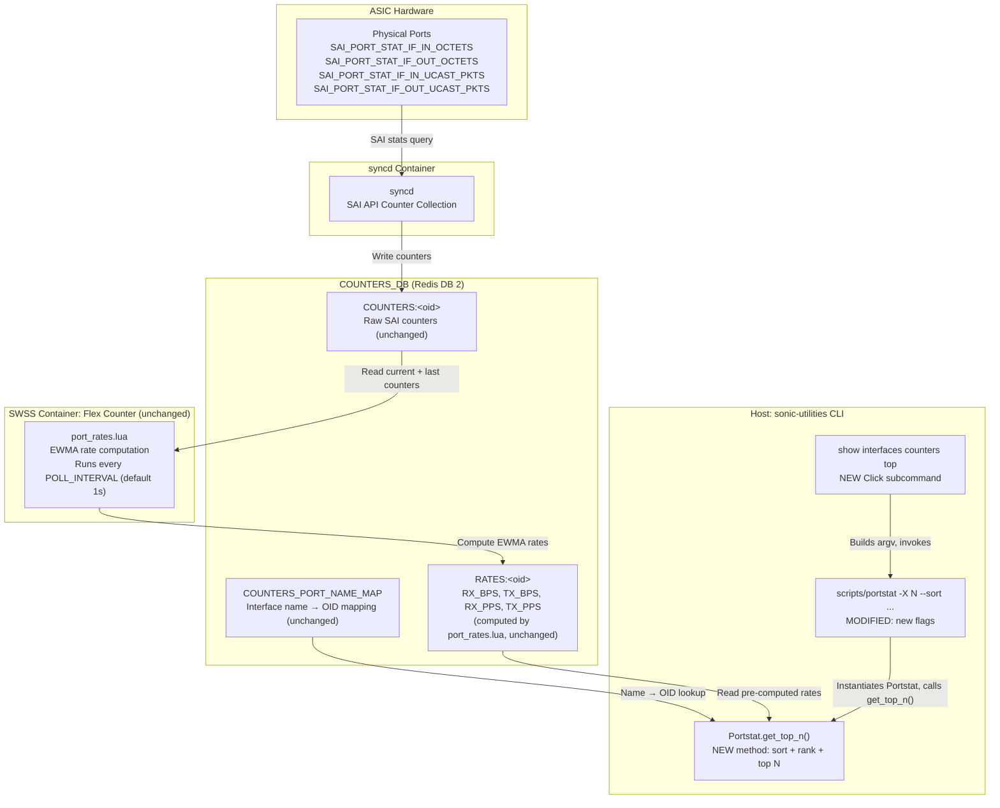
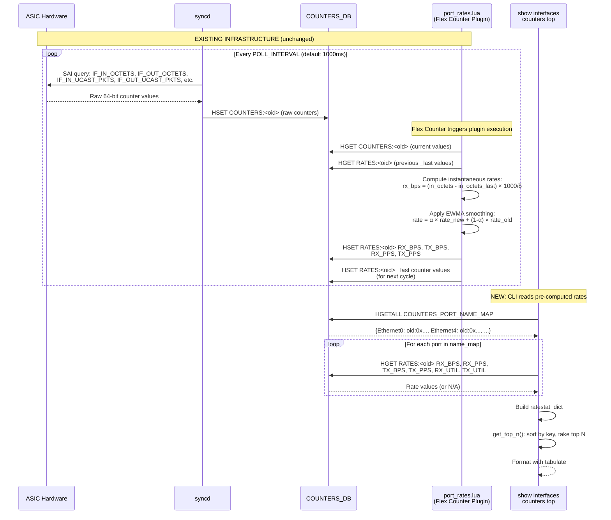
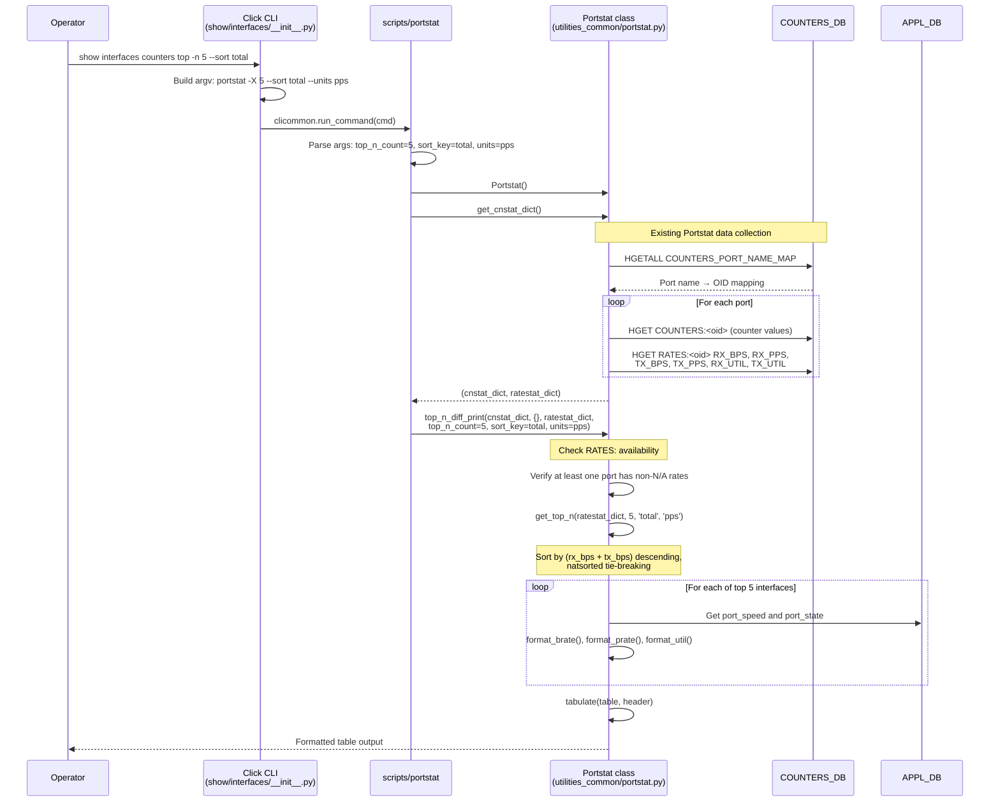

# Top N Interfaces by Traffic in SONiC
# High Level Design Document
### Rev 0.2

## Table of Content
- [List of Tables](#list-of-tables)
- [List of Figures](#list-of-figures)
- [1 Revision](#1-revision)
- [2 Scope](#2-scope)
- [3 Definitions/Abbreviations](#3-definitionsabbreviations)
- [4 Overview](#4-overview)
- [5 Requirements](#5-requirements)
- [6 Architecture Design](#6-architecture-design)
- [7 High-Level Design](#7-high-level-design)
- [8 SAI API](#8-sai-api)
- [9 Configuration and management](#9-configuration-and-management)
- [10 Warmboot and Fastboot Design Impact](#10-warmboot-and-fastboot-design-impact)
- [11 Memory Consumption](#11-memory-consumption)
- [12 Restrictions/Limitations](#12-restrictionslimitations)
- [13 Testing Requirements/Design](#13-testing-requirementsdesign)
    - [13.1 Unit Test cases](#131-unit-test-cases)
    - [13.2 System Test cases](#132-system-test-cases)
- [14 Open/Action items - if any](#14-openaction-items---if-any)

# List of Tables
* [Table 1: Revision](#1-revision)
* [Table 2: Abbreviations](#3-definitionsabbreviations)
* [Table 3: Modules to be Updated](#71-modules-design)

# List of Figures
* [Figure 1: High-Level Architecture](#6-architecture-design)
* [Figure 2: General Data Flow](#general-data-flow)
* [Figure 3: CLI Execution Flow](#cli-execution-flow)

# 1 Revision
| Rev |     Date    |       Author            | Change Description                |
|:---:|:-----------:|:-----------------------:|-----------------------------------|
| 0.1 | 2026-05-29  | Rishik Yalamanchili     | Initial version (history buffer approach) |
| 0.2 | 2026-06-25  | Rishik Yalamanchili     | Revised: thin filter on Portstat using pre-computed RATES: table |

# 2 Scope
This document describes the high level design of the Top N Interfaces by Traffic feature. It covers:
1. The addition of a `top` subcommand to the existing `show interfaces counters` CLI group within `sonic-utilities`.
2. The extension of the `scripts/portstat` script with new flags for top-N filtering and sorting.
3. The addition of a `get_top_n()` method to the existing `Portstat` class in `utilities_common/portstat.py`.

No changes are required to `sonic-swss`, `orchagent`, Lua plugins, Config DB, or any daemon. The entire feature is implemented within the `sonic-utilities` repository as a **thin filter** on top of existing infrastructure.

# 3 Definitions/Abbreviations
## Table 1: Abbreviations
| Definitions/Abbreviation | Description                                |
|--------------------------|--------------------------------------------|
| RX                       | Receive / Ingress traffic                  |
| TX                       | Transmit / Egress traffic                  |
| BPS                      | Bytes Per Second (as stored in RATES: table by port_rates.lua) |
| PPS                      | Packets Per Second                         |
| OID                      | SAI Object Identifier                      |
| EWMA                     | Exponential Weighted Moving Average        |

# 4 Overview

This document provides general information about the design and implementation of the `show interfaces counters top` feature in SONiC. This feature enables network operators to instantaneously identify the top N interfaces carrying the highest traffic by leveraging the pre-computed rate values already maintained in the `COUNTERS_DB RATES:` table by the existing `port_rates.lua` Flex Counter plugin.

SONiC exposes per-interface traffic counters via COUNTERS_DB and provides CLI tools such as `portstat` and `show interfaces counters` to display them. The existing `show interfaces counters rates` command (backed by `portstat -R`) can display current rates for all interfaces, but operators currently lack a mechanism to quickly identify which interfaces are carrying the **highest** traffic at any given time.

In large-scale deployments with hundreds of ports, manually scanning counter output to find congested interfaces is inefficient and error-prone. Operators need a single command that returns the top N busiest interfaces, ranked by throughput, instantaneously.

## 4.1 Current Limitations

The current SONiC rate infrastructure has the following characteristics that inform this design:

1. **No ranking or filtering**: The existing `portstat -R` / `show interfaces counters rates` command displays rates for **all** interfaces in natural sort order. There is no option to sort by traffic volume or limit the output to the top N.

## 4.2 Proposed Solution

This feature introduces `show interfaces counters top` as a **thin filter on top of the existing `Portstat` class**. The design reads the `RATES:<oid>` entries that `orchagent`'s `port_rates.lua` plugin already maintains, sorts them by a user-selected key, and displays the top N results.

**Key properties:**
- **Instantaneous**: Results appear in ~50ms (single Redis read pass), with no blocking delay.
- **Numerically consistent**: The rates shown are identical to those displayed by `show interfaces counters rates`, since both read from the same `RATES:` table.
- **Zero backend changes**: No new daemons, no new DB tables, no Lua script modifications, no orchagent changes.
- **Three files changed**: The entire feature is implemented by modifying three files in `sonic-utilities`.

## 4.3 Design Philosophy

The design follows the principle of **maximum reuse of existing infrastructure**:

```
┌──────────────────────────────────────────────────────────────────┐
│ Existing Infrastructure (unchanged)                              │
│                                                                  │
│   ASIC → syncd → COUNTERS:<oid> → port_rates.lua → RATES:<oid>   │
│                                                                  │
│   Portstat class: get_cnstat_dict() → ratestat_dict              │
│   Portstat class: get_port_state(), get_port_speed()             │
│   netstat.py: format_brate(), format_prate(), format_util()      │
└──────────────────────────────────────────────────────────────────┘
                              │
                    ┌─────────▼──────────┐
                    │ NEW: Thin Filter   │
                    │                    │
                    │ get_top_n()        │
                    │ Sort + Rank + Top  │
                    │ top CLI command    │
                    └────────────────────┘
```

This approach ensures that the `top` command benefits from all existing and future improvements to the rate computation pipeline (e.g., improved EWMA tuning, FEC BER enhancements) without any additional maintenance burden.

# 5 Requirements

## 5.1 Functional Requirements

- The CLI command must return the top N interfaces **instantaneously** by default, leveraging pre-computed rates in the `COUNTERS_DB RATES:` table. There must be no `time.sleep()` or blocking delay under normal operation.

- The interfaces must be rankable by different keys: `total`, `rx`, `tx`, and `util` (utilization).

- The rank must be capable of sorting by `bps` (Bytes per second) or `pps` (Packets per second).

- The default sort key must be `total` throughput (`RX + TX`), and the default unit `pps`.

- The CLI must be capable of producing JSON formatted output for automation systems.

- The output should provide deterministic tie-breaking for interfaces with identical rates (e.g., multiple interfaces with 0 bps should be naturally sorted by name using `natsorted`).

## 5.2 CLI Requirements

A new CLI command will be introduced as a subcommand of `show interfaces counters`:

```
show interfaces counters top [OPTIONS]

Options:
  -n, --count INTEGER          Number of top interfaces to show. Default: 5.
  --sort [rx|tx|total|util]    Sort key. Default: total.
  --units [bps|pps]            Rank by bytes/sec or packets/sec. Default: pps.
  -j, --json                   JSON output.
  --verbose                    Print the underlying command.
```

**Design decisions for the CLI surface:**

1. **Placement under `counters`**: The command is placed at `show interfaces counters top` rather than `show interfaces top`. This is consistent with the existing CLI tree where all counter-related views (`rates`, `errors`, `fec-stats`, `trim`, `detailed`) are subcommands of `counters`.

2. **`--count` vs positional argument**: The count is an option (`-n 10`) rather than a positional argument to maintain consistency with the other portstat-based subcommands and to allow a sensible default of 5.

## 5.3 Scalability Requirements

- The command execution time must remain sub-second regardless of the number of ports, as it performs a single pass through the `ratestat_dict` already loaded in memory by `Portstat.get_cnstat_dict()`.

- The sorting operation is `O(N log N)` where N is the number of ports. For a 512-port system, this is negligible (~500 comparisons).

- No additional Redis operations are introduced beyond what `Portstat.get_cnstat_dict()` already performs. The `top` filter is a pure Python in-memory operation on the data already fetched.

# 6 Architecture Design

The feature relies on a read-only consumer model. The new CLI command simply reads the data it already produces and applies a sort-and-filter operation.



**Architecture summary:**
- The architecture diagram is **read-only from the CLI's perspective**. Everything to the left of the "Host: sonic-utilities CLI" box is existing infrastructure that remains completely unchanged.


# 7 High-Level Design

## 7.1 Modules Design

The following table summarizes all components that require modification or creation. All changes are within the `sonic-utilities` repository.

| Module / File | Repository | Action |
|---|---|---|
| `show/interfaces/__init__.py` | sonic-utilities | **Modify**: add `top` Click subcommand to `counters` group |
| `scripts/portstat` | sonic-utilities | **Modify**: add `-X/--top_n`, `--sort`, `--units` flags |
| `utilities_common/portstat.py` | sonic-utilities | **Modify**: add `get_top_n()` method and `top_n_diff_print()` method |
| `tests/portstat_top_n_test.py` | sonic-utilities | **New**: unit tests for the top-N feature |

**No changes required in:**
- `sonic-swss` (no orchagent, no Lua plugin, no flexcounterorch changes)
- `counterpoll` (no new counter groups)
- Config DB (no new schema)
- COUNTERS_DB (no new key families)


The `show/interfaces/__init__.py` module will define the `top` CLI entry point using Click, which simply constructs the arguments and delegates to the `portstat` script. The `portstat` script will parse the new arguments and invoke the logic inside the `Portstat` class. 

In `sonic-utilities/utilities_common/portstat.py`, two new methods are added to the `Portstat` class to handle the core logic:

**1. `get_top_n()`: Sort and rank interfaces**

```python
def get_top_n(self, ratestat_dict, n, sort_key='total', units='pps'):
    """
    Sort interfaces by the specified rate key and return the top N.

    Args:
        ratestat_dict: OrderedDict mapping port_name -> RateStats namedtuple
        n: Number of top interfaces to return
        sort_key: 'rx', 'tx', 'total', or 'util'
        units: 'bps' or 'pps'

    Returns:
        List of (port_name, RateStats) tuples, sorted descending by the
        specified key, with natsorted tie-breaking for deterministic output.
    """
    pass
```

**Key design decisions for `get_top_n()`:**

1. **`safe_float()` helper**: The `RATES:` table may contain `N/A` values when the rate plugin has not yet initialized or when a specific field is not supported by the platform. All `N/A` values are treated as `0.0` for sorting purposes.

2. **Utilization fallback**: When `RX_UTIL` / `TX_UTIL` are `N/A` (which is the common case since `port_rates.lua` does not set these fields), utilization is computed on-the-fly from `RX_BPS` and the port speed. This mirrors the existing behavior in `cnstat_diff_print()`.

3. **`natsort` tie-breaking**: When multiple interfaces have the same rate value (e.g., multiple idle interfaces at 0 bps), they are ordered by natural sort order of the interface name. This ensures `Ethernet2` appears before `Ethernet10`, and the output is deterministic across runs. The `natsort` library is already imported in `portstat.py`.

4. **No mutation**: The method does not modify `ratestat_dict`. It creates a new sorted list and returns a slice.


**2. `top_n_diff_print()`: Format and display the top N table**

```python
def top_n_diff_print(self, cnstat_new_dict, cnstat_old_dict, ratestat_dict,
                    top_n_count, sort_key, units, use_json):
    """
    Display the top N interfaces ranked by the specified rate key.

    Rates come from the RATES: table.

    Args:
        cnstat_new_dict: Current counter stats (unused, passed for signature compatibility)
        cnstat_old_dict: Previous counter stats (unused)
        ratestat_dict: Rate stats from RATES: table
        top_n_count: Number of top interfaces to display
        sort_key: 'rx', 'tx', 'total', or 'util'
        units: 'bps' or 'pps'
        use_json: Whether to output JSON
    """
    pass
```

**Key design decisions for `top_n_diff_print()`:**

1. **Reuse of existing formatters**: The method reuses `format_brate()`, `format_prate()`, and `format_util()` from `utilities_common/netstat.py`, which are the exact same functions used by the existing `portstat -R` display. This ensures visual consistency with `show interfaces counters rates`.

2. **UTIL column**: The `UTIL` column shows the maximum of RX and TX utilization for the interface. This represents the "bottleneck" direction. The JSON output provides both `rx_util_pct` and `tx_util_pct` separately for consumers that need directional utilization.

3. **JSON structure**: The JSON output includes metadata (`sampled_at`, `sort_key`) and a flat array of interface objects.

## 7.2 Flows

### General Data Flow

The following sequence diagram illustrates the end-to-end data flow from ASIC counter collection through the pre-computed rates pipeline to the CLI display. Most region shows the existing infrastructure that remains **unchanged**; only the final consumer (CLI) is new.



### CLI Execution Flow

The following sequence diagram shows the internal call chain when an operator runs `show interfaces counters top -n 5 --sort total`:




# 8 SAI API

The feature relies on the same SAI counters already polled by the existing `port_rates.lua` plugin. **No new SAI API calls are required.**

# 9 Configuration and management


## 9.1 CLI model Enhancements

The `top` feature introduces a new subcommand of `counters` and new flags in `portstat`. Backward compatibility is fully maintained. No existing CLI commands, scripts, or automation workflows are affected. Users can save and restore configurations without impact.

| Existing command | Impact |
|---|---|
| `show interfaces counters` | Unchanged (`top` is a new subcommand) |
| `show interfaces counters rates` | Unchanged (continues to use `portstat -R`) |
| `show interfaces counters errors` | Unchanged |
| `portstat` (direct invocation) | New flags added (`-X`, `--sort`, `--units`), but existing flags and behavior are unmodified |
| `counterpoll` | Unchanged (no new counter groups) |

## 9.2 CLI Commands

### show interfaces counters top

### Basic usage: show top 5 interfaces (default)

```bash
admin@sonic:~$ show interfaces counters top
Sampled at 2026-06-25 10:14:03

  RANK  IFACE          STATE      RX_BPS       RX_PPS      TX_BPS       TX_PPS    TOTAL_BPS     TOTAL_PPS     UTIL
------  -----------  -------  ----------  -----------  ----------  -----------  -----------  ------------  -------
     1  Ethernet120        U  852.13 MB/s  1047000.00/s  783.22 MB/s  962500.00/s  1635.35 MB/s  2009500.00/s  85.21%
     2  Ethernet112        U  621.09 MB/s   763000.00/s  598.04 MB/s  735000.00/s  1219.13 MB/s  1498000.00/s  62.11%
     3  Ethernet64         U  482.01 MB/s   593000.00/s  521.57 MB/s  641000.00/s  1003.58 MB/s  1234000.00/s  52.16%
     4  Ethernet0          U  321.55 MB/s   395000.00/s  301.23 MB/s  370000.00/s   622.78 MB/s   765000.00/s  32.15%
     5  Ethernet48         U  211.06 MB/s   259000.00/s  198.92 MB/s  244500.00/s   409.98 MB/s   503500.00/s  21.11%
```

### Custom count

```bash
admin@sonic:~$ show interfaces counters top -n 3
Sampled at 2026-06-25 10:14:05

  RANK  IFACE          STATE      RX_BPS       RX_PPS      TX_BPS       TX_PPS    TOTAL_BPS     TOTAL_PPS     UTIL
------  -----------  -------  ----------  -----------  ----------  -----------  -----------  ------------  -------
     1  Ethernet120        U  852.13 MB/s  1047000.00/s  783.22 MB/s  962500.00/s  1635.35 MB/s  2009500.00/s  85.21%
     2  Ethernet112        U  621.09 MB/s   763000.00/s  598.04 MB/s  735000.00/s  1219.13 MB/s  1498000.00/s  62.11%
     3  Ethernet64         U  482.01 MB/s   593000.00/s  521.57 MB/s  641000.00/s  1003.58 MB/s  1234000.00/s  52.16%
```

### Sort by RX traffic

```bash
admin@sonic:~$ show interfaces counters top -n 5 --sort rx
Sampled at 2026-06-25 10:14:10

  RANK  IFACE          STATE      RX_BPS       RX_PPS      TX_BPS       TX_PPS    TOTAL_BPS     TOTAL_PPS     UTIL
------  -----------  -------  ----------  -----------  ----------  -----------  -----------  ------------  -------
     1  Ethernet120        U  852.13 MB/s  1047000.00/s  783.22 MB/s  962500.00/s  1635.35 MB/s  2009500.00/s  85.21%
     2  Ethernet112        U  621.09 MB/s   763000.00/s  598.04 MB/s  735000.00/s  1219.13 MB/s  1498000.00/s  62.11%
     3  Ethernet64         U  482.01 MB/s   593000.00/s  521.57 MB/s  641000.00/s  1003.58 MB/s  1234000.00/s  52.16%
     4  Ethernet0          U  321.55 MB/s   395000.00/s  301.23 MB/s  370000.00/s   622.78 MB/s   765000.00/s  32.15%
     5  Ethernet48         U  211.06 MB/s   259000.00/s  198.92 MB/s  244500.00/s   409.98 MB/s   503500.00/s  21.11%
```

### Sort by utilization

```bash
admin@sonic:~$ show interfaces counters top -n 5 --sort util
Sampled at 2026-06-25 10:14:15

  RANK  IFACE          STATE      RX_BPS       RX_PPS      TX_BPS       TX_PPS    TOTAL_BPS     TOTAL_PPS     UTIL
------  -----------  -------  ----------  -----------  ----------  -----------  -----------  ------------  -------
     1  Ethernet120        U  852.13 MB/s  1047000.00/s  783.22 MB/s  962500.00/s  1635.35 MB/s  2009500.00/s  85.21%
     2  Ethernet112        U  621.09 MB/s   763000.00/s  598.04 MB/s  735000.00/s  1219.13 MB/s  1498000.00/s  62.11%
     3  Ethernet64         U  482.01 MB/s   593000.00/s  521.57 MB/s  641000.00/s  1003.58 MB/s  1234000.00/s  52.16%
     4  Ethernet0          U  321.55 MB/s   395000.00/s  301.23 MB/s  370000.00/s   622.78 MB/s   765000.00/s  32.15%
     5  Ethernet48         U  211.06 MB/s   259000.00/s  198.92 MB/s  244500.00/s   409.98 MB/s   503500.00/s  21.11%
```

### Rank by packets per second

```bash
admin@sonic:~$ show interfaces counters top -n 3 --units pps
Sampled at 2026-06-25 10:14:20

  RANK  IFACE          STATE      RX_BPS       RX_PPS      TX_BPS       TX_PPS    TOTAL_BPS     TOTAL_PPS     UTIL
------  -----------  -------  ----------  -----------  ----------  -----------  -----------  ------------  -------
     1  Ethernet120        U  852.13 MB/s  1047000.00/s  783.22 MB/s  962500.00/s  1635.35 MB/s  2009500.00/s  85.21%
     2  Ethernet8          U   13.37 MB/s   900000.00/s    1.35 MB/s  800000.00/s    14.72 MB/s  1700000.00/s    N/A
     3  Ethernet112        U  621.09 MB/s   763000.00/s  598.04 MB/s  735000.00/s  1219.13 MB/s  1498000.00/s  62.11%
```

Note: When sorting by PPS, Ethernet8 (which has many small packets at high PPS but lower BPS) may rank higher than interfaces with higher byte rates but fewer, larger packets.


### JSON output

```bash
admin@sonic:~$ show interfaces counters top -n 3 --json
{
    "sampled_at": "2026-06-25T10:14:25.118000",
    "sort_key": "total_bps",
    "count": 3,
    "interfaces": [
        {
            "rank": 1,
            "iface": "Ethernet120",
            "state": "U",
            "rx_bps": 852130000.0,
            "rx_pps": 1047000.0,
            "tx_bps": 783220000.0,
            "tx_pps": 962500.0,
            "total_bps": 1635350000.0,
            "total_pps": 2009500.0,
            "rx_util_pct": 68.17,
            "tx_util_pct": 62.66
        },
        {
            "rank": 2,
            "iface": "Ethernet112",
            "state": "U",
            "rx_bps": 621090000.0,
            "rx_pps": 763000.0,
            "tx_bps": 598040000.0,
            "tx_pps": 735000.0,
            "total_bps": 1219130000.0,
            "total_pps": 1498000.0,
            "rx_util_pct": 49.69,
            "tx_util_pct": 47.84
        },
        {
            "rank": 3,
            "iface": "Ethernet64",
            "state": "U",
            "rx_bps": 482010000.0,
            "rx_pps": 593000.0,
            "tx_bps": 521570000.0,
            "tx_pps": 641000.0,
            "total_bps": 1003580000.0,
            "total_pps": 1234000.0,
            "rx_util_pct": 38.56,
            "tx_util_pct": 41.73
        }
    ]
}
```


### All interfaces have zero traffic

```bash
admin@sonic:~$ show interfaces counters top -n 3
Sampled at 2026-06-25 10:14:40

  RANK  IFACE          STATE      RX_BPS     RX_PPS      TX_BPS     TX_PPS    TOTAL_BPS      TOTAL_PPS     UTIL
------  -----------  -------  ----------  ---------  ----------  ---------  -----------  -------------  -------
     1  Ethernet0          U    0.00 B/s     0.00/s    0.00 B/s     0.00/s     0.00 B/s         0.00/s   0.00%
     2  Ethernet4          U    0.00 B/s     0.00/s    0.00 B/s     0.00/s     0.00 B/s         0.00/s   0.00%
     3  Ethernet8          U    0.00 B/s     0.00/s    0.00 B/s     0.00/s     0.00 B/s         0.00/s   0.00%
```

Note: Interfaces with identical (zero) rates are tie-broken by natural sort order of the interface name.

## 9.3 Config DB Enhancements

There is no change in configuration or Config DB required for this feature. The feature operates entirely by reading pre-existing counter data from the `COUNTERS_DB` (specifically the `RATES:` table). Downward compatibility is naturally maintained as no schema changes are introduced.

# 10 Warmboot and Fastboot Design Impact

## Warmboot

During a warmboot, the `syncd` process restarts while preserving forwarding state. The COUNTERS_DB content persists across the restart since it resides in the Redis database engine, which is not flushed during warmboot.

**Impact on the `top` command:**

- The `RATES:<oid>` hash entries survive the warmboot since they are stored in COUNTERS_DB.
- When `port_rates.lua` resumes execution after warmboot, it enters the EWMA initialization phase:
  1. **First cycle post-restart** (`INIT_DONE` state reset or stale): The plugin stores `_last` counter values but does not compute rates. The existing `RX_BPS`/`TX_BPS` values in `RATES:<oid>` remain from the pre-warmboot computation and are **stale but valid** for a short period.
  2. **Second cycle**: Raw (unsmoothed) rates are computed from the delta between the current and `_last` values.
  3. **Third cycle onward**: EWMA smoothing resumes normally.
- During the 1-2 second warmboot gap, the `top` command will display the last valid rates. These are slightly stale but provide a reasonable approximation.
- No error messages or degraded behavior occurs. The stale rates are automatically replaced by fresh values within 2-3 polling cycles.

## Fastboot

During a fastboot, COUNTERS_DB is flushed. This means all `RATES:<oid>` entries are cleared.

**Impact on the `top` command:**

- After fastboot, the `RATES:` table is empty. The `top` command will detect this condition (all values are `N/A`) and display no interfaces.
- Within 2-3 polling cycles (2-3 seconds at default polling interval), `port_rates.lua` repopulates the `RATES:` table and the `top` command resumes normal operation.

# 11 Memory Consumption

TODO: Cover the memory consumption analysis for the new feature.

# 12 Things to be Considered

1. **`RATES:` population varies by platform:** Some vendor SDKs disable specific stats. When a counter is unavailable, the corresponding `RATES:<oid>` field will be `N/A`. The `safe_float()` helper safely treats these as `0.0` for sorting, ensuring the CLI gracefully handles incomplete data.
2. **VOQ chassis path:** On supervisor cards, `Portstat.collect_stat_from_lc()` reads from `CHASSIS_STATE_DB` using a different schema. The rate fields (`rx_bps`, `tx_bps`, etc.) are present there too, and populate the same dictionary that the `top` filter operates on. (Needs one VOQ-fixture test to confirm).
3. **EWMA α value limitation:** The smoothing factor is configured per-deployment in `RATES:PORT`. A short microburst won't show up in these stats since it gets diluted by the EWMA smoothing. Users investigating microbursts should be directed to the watermark counters (`show queue watermark`) instead.

# 13 Testing Requirements/Design

Since this feature is entirely within `sonic-utilities` and does not modify `sonic-swss`, `orchagent`, or any Lua plugins, the testing strategy is simplified. There are **no syncd integration tests** needed. All tests are Python-based, using the existing mock infrastructure in `sonic-utilities`.

## 13.1 Unit Test cases

A new test file `tests/portstat_top_test.py` will be created, using the existing `click.testing.CliRunner` for CLI invocations and mock `COUNTERS_DB` data based on existing fixtures. 

1. Default invocation
    * Verify `show interfaces counters top` returns exactly 5 interfaces (default) sorted by total BPS descending.
2. Custom count
    * Verify `show interfaces counters top -n 3` returns exactly 3 interfaces.
    * Verify behavior when the requested count exceeds the number of available interfaces (returns all without error).
3. Sort and Units flags
    * Verify `--sort rx` and `--sort tx` correctly sort by RX and TX rates.
    * Verify `--sort util` correctly sorts interfaces by utilization percentage.
    * Verify `--units pps` correctly sorts based on packets per second instead of bytes per second.
4. Tie-breaking
    * Verify deterministic ordering (natural sort order by interface name) when multiple interfaces have identical rates (e.g., all 0 bps).
5. Error handling
    * Verify invalid sort keys (e.g., `--sort bandwidth`) raise `BadParameter` errors.
    * Verify invalid counts (e.g., `-n 0` or `-n -1`) raise `BadParameter` errors.
    * Verify empty or unavailable `RATES:` table gracefully handles missing data without tracebacks.
6. JSON output
    * Verify `--json` flag produces structurally correct JSON containing `sampled_at`, `sort_key`, `count`, and a list of `interfaces` with float values.

## 13.2 System Test cases

System tests are run on a real SONiC switch or a sonic-vs (Virtual Switch) to verify end-to-end behavior within the `sonic-mgmt` framework.

1. Basic operation on hardware switch
    * Using a traffic generator, push traffic at varying rates on multiple interfaces.
    * Run `show interfaces counters top -n 5` and verify the output accurately reflects the top congested interfaces.
2. Consistency with existing `rates` command
    * Run `show interfaces counters rates` followed by `show interfaces counters top`.
    * Verify the reported BPS/PPS values match exactly, as both rely on the same `RATES:` table.

# 14 Open/Action items - if any

## 14.1 Stretch Goals

The following features are not part of the initial implementation but could be added as follow-up PRs:

### 14.1.1 `--threshold` Flag

A `--threshold X` flag would show only interfaces exceeding X bytes/sec (or packets/sec). This is useful for alerting scripts that want to identify congested interfaces above a specific watermark.

**Example:**
```bash
show interfaces counters top --threshold 1000000000
# Only shows interfaces with total rate > 1 GB/s
```

### 14.1.2 `--reverse` Flag

A `--reverse` flag would sort ascending instead of descending, showing the **least** busy interfaces. This is useful for capacity planning and identifying underutilized interfaces.

### 14.1.3 `--period` Fallback Mode

An optional `--period` flag could be added as a fallback to perform a two-sample delta calculation. This is useful for environments where the `port_rates.lua` plugin is not loaded and the `RATES:` table is unpopulated (such as Virtual Switch environments).
When the `RATES:` table is empty or all values are `N/A`, and `--period` is not specified, the CLI could print a clear message suggesting the use of `--period`.

## 14.2 Open Questions

### Note: Will Add later.
